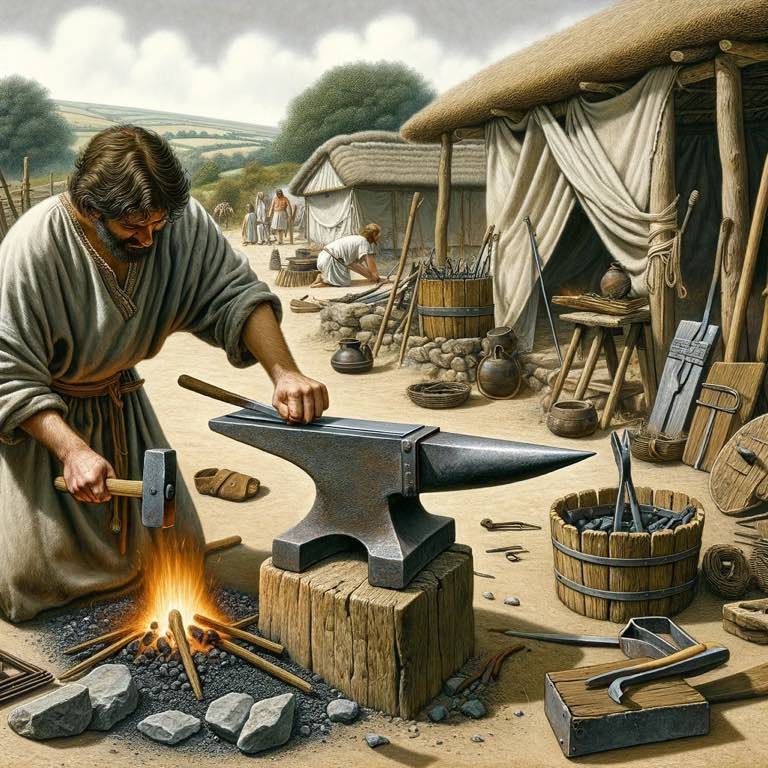

# Scriptures

The Lord warns Nephi to flee. He does and his people begin to prosper. There's something powerful to that: when you're in an environment where it's not healthy, the Lord wants you to get to a better place. 

> And I, Nephi, did take the sword of Laban, and after the manner of it did make many swords, lest by any means the people who were now called Lamanites should come upon us and destroy us; for I knew their hatred towards me and my children and those who were called my people.
> [2 Nephi 5.14](../scriptures/2-nephi-5.14)

{.preview-image}

# Meaning

The Lord will guide us in out individual and highly personal circumstances. 