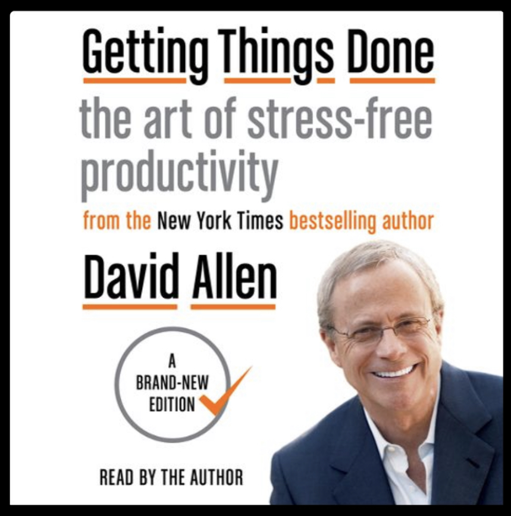

# Principles and Core Insights

After 21% my takeaways are:

1. “My mind is weighed down by all of the ideas of things I can do.” I waste my time on todos that are just “go to doctor”, but should be “schedule appointment to go to doctor”. Anything that only takes 2 min should be done immediately. Anything longer later. But I love that clarity - I’ve often written lots of todos but not from the “next action to take” perspective.
2. “Visions can be built from the ground up rather than just top down.” I’ve tried writing down big visions for my 10 year future and it never works for me. I’ve got anxiety when I try to think where I want to be in 10 years. I mean, I know I want to be happy, be best friends with my wife and kids and have meaningful relationships but whether I’m still a data scientist or a farmer by then is anyones guess. (I wanna keep my options open.) But as I look at the things on my todo list and “eventual” to do list, a different picture emerges. I know I want to be a writer (hence this blog), I know I want to travel to XYZ location, to be involved in giving back, etc. TLDR: I know things I want to experience in life. I don’t have to craft value statements and invent ideas of what to do (seems forced). Instead I can reflect on what’s currently exciting and important to me and categorize those things into high levels values/missions. This will help me when I need to prioritize so not every whim of an idea gets my attention.
3. GTD book just lays out what a todo is. It breaks down the problem of doing things (big and small) into what they are (time sensitive, someday, etc). Whether I’ll follow the system is up for debate, but I love the ideas so far. It very much fits my naturally organized mind, but may not work for more spontaneous folks that don’t like as much structure and list keeping.
4. Most of my “todos” have been “intended outcomes”, but not “next actions”. For example, I see I have “change car battery” on my list right now and “plan yosemite trip”. But these aren’t todos. I can’t organize and prioritize outcomes. I can only organize and prioritize actions, he says. Changing these to “call mechanic to book oil and battery change and identify an hour in your calendar”. And “open recreation.gov when walking around the house and find a campsite.”
5. Organize tasks around where you’ll do them. This is in line with Atomic habits which states to be hyper specific about where and when you’ll do something. “Call grandma when I get into my car tomorrow morning to go to work.” Or “take a moment at my desk during lunchtime to find a mechanic by opening Google Maps and plan an oil change. Find 1 open hour on the calendar.”

# Putting it into practice

I’ve been using TickTick for my task manager, which has Lists (folders) where I can put my tasks and tags so I can label and categorize each task. Here’s my organization strategy:

* When jotting ideas write intended outcome and next action as my todo.
* Tag with where I’ll do it and provide day or time it’s due (if applicable)  
* Move each item to a respective list:
  * ASAP - there’s a useful urgency to this task (begin memo)
  * Eventually - there’s no urgency but I know I’ll want to do this
  * Someday maybe - no urgency and no commitment, but it’s an idea of something I want to do.
* Tagging system: tag each item with either Work or Personal. Then within that, some meaningful themes:
  * ProjectName (work deliverable or personal project like “ImproveMyHealth”, “BuildApp”)[^1]
  * Location (where I’ll do it). Around the house. At desk. In car. While cleaning the house, etc. this is habit stacking. Most work stuff is done at my desk.
  * when I’ll do it. Stack with other activities. Examples: Before lunch.
  * Duration (how long it takes: 1, 2, 4 hours, 5, 30min). This might be useful for planning.
* List system. Move from inbox to list when properly categorized. I like “Work” and “Personal” lists. I think since you can use unlimited tags, and tags can be nested in TickTick, there’s no substantive differ ne between list and tag.  Not sure yet how to use the TickTick lists when tags are so useful. Lists of work and personal.

In summary:

* Idea/task comes.
* Document in inbox.
* Clarify the intended outcome and the next action.
* Organize: tag. Set up reminder. Move out of inbox to list.
* Review and Prioritize: understand where these ideas will take you and choose your adventure.
* Do!

[^1]: **Deciding Vision**: As I write this, choosing a project  might be a good place to insert a goal (intended outcome) as a project name. Instead of Exercise, the intended outcome is improving health. The goal is being able to run a 5k. So perhaps goal/objective is “ImproveHealth” and KR is “run 5k”. These goals can be identified by asking the 5 whys. If I have an idea if “go running” as my task, a good grounds-up vision exercise would be to ask “why do I want to run a mile tomorrow? Is it to accomplish something or to relax my mind? Why is relaxing my mind important to me? Why is my mental health important? Etc. I think subconsciously ideas come of what to do next all the time “I should work out” but rarely do I take the time to ask “why do I see the need to work out? What’s the greater vision here for this task?” Understanding that vision can help prioritize and build a desire to accomplish the task. If the idea “learn a new language” comes up, asking why can help me realize “oh, this is just for fun and won’t be for anything meatier than having fun! No pressure on this task and maybe I’ll never do it.” The nag to run a mile might help me realize “I need to take care of my health, and this can’t wait.”

   
