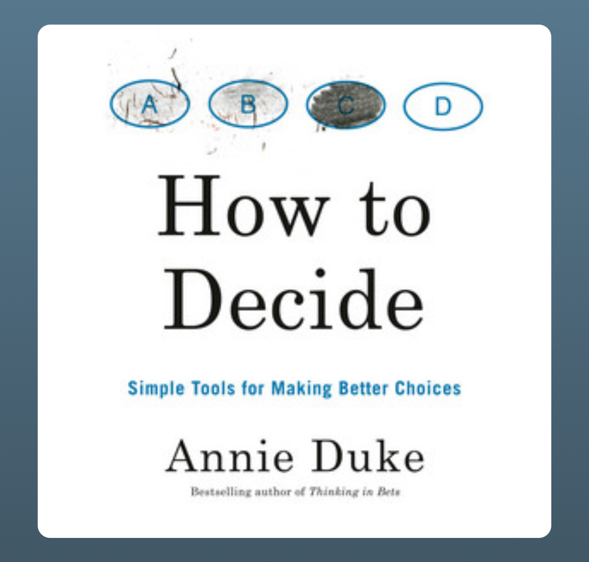

{.preview-image}

What is my best decision? Worst?

- resulting: focusing on outcomes, rather than expected values and doing the best
- to improve decision making: focus on what the process was for decision making. Information gathering. Question asking.
- Remember choosing to leave Novi, wondering if someone was going to be a millionaire in my absence. Couldn't help but feel I was leaving money on the table by leaving. But I decided to leave to pursue what I was passionate about, and regardless that Novi went under I felt that was the right call as I finished my masters.

Actions:
- make a knowledge tracker. Details on decisions. Info known before/after. Make this going forward

Decision process:
- where do you want to go?
- What are all the ways to get there?
- By taking X choice, what are other ways it could go? What's the probability?
