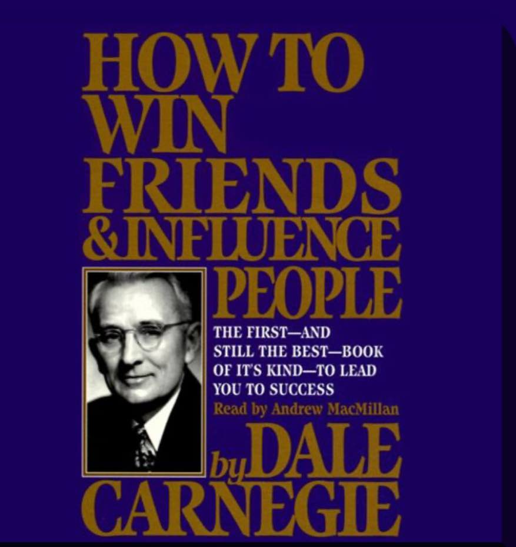

2024-01-22
- father poem. Father forgets. 
- bate the hook to please the fish
	- Tell them what they want
	- And how to get it
- Lavish with praise. This is greater incentive than any criticism 
- What do they want? (Not what do I want?) "smoking will keep you from making the bball team "
- Ford: put yourself in their position. Consider it. And consider your own
- Consider how they'll receive your email. They have a ton of problems. They're overwhelmed. Don't sell them. Teach them the benefits they'll get. 
- Flattery vs appreciation - flattery is lip service. If you're trying to convince someone to do something and you're using flattery, then thats manipulation. And you're prone to get angry if they don't want to do it (kids). But if you're sincere, you'll find a solution
- Arouse in others an eager want
	- Don't tell someone an idea. Plant the seed and make them think it's their own. 

2024-01-20
- 85% of success is in non-technical skills. Communication. 
- We grow far faster by rewarding good behavior than punishing bad behavior 
	- Kids. 
	- Futility of criticism 
	- Ask questions. "Does your hard hat not fit properly? It will save you. "
- Don't kick a beehive if you want honey 
- "I don't see how I could have done any better"
- Criticism - Abraham Lincoln never sent the letter 
- 

{.preview-image}

