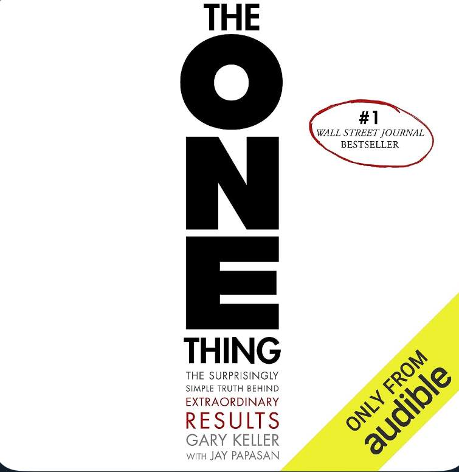

2024-07-22
- counterbalanxinf. Go to the extremes to get things roughly in shape. → I feel like this is what I've been doing. 

2024-07-19

- dopamine when switching tasks

2024-07-16

* if you could do one thing that makes obsolete all the others, what is it?
* Write down 100 todos. Then say never or not now to 99 of them. 

{.preview-image}