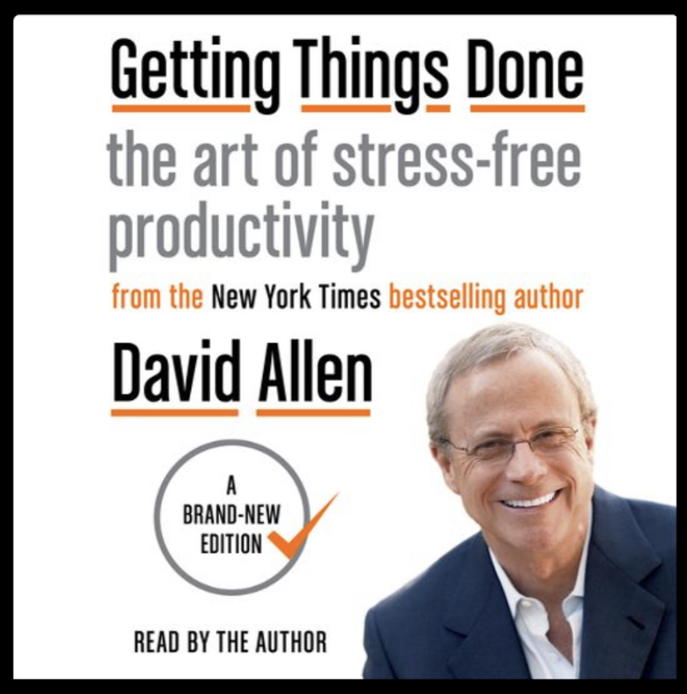

After 21% my takeaways are:

1. “My mind is weighed down by all of the ideas of things I can do.” I waste my time on todos that are just “go to doctor”, but should be “schedule appointment to go to doctor”. Anything that only takes 2 min should be done immediately. Anything longer later. But I love that clarity - I’ve often written lots of todos but not from the “next action to take” perspective. 
2. “Visions can be built from the ground up rather than just top down.” I’ve tried writing down big visions for my 10 year future and it never works for me. I’ve got anxiety when I try to think where I want to be in 10 years. I mean, I know I want to be happy, be best friends with my wife and kids and have meaningful relationships but whether I’m still a data scientist or a farmer by then is anyones guess. (I wanna keep my options open.) But as I look at the things on my todo list and “eventual” to do list, a different picture emerges. I know I want to be a writer (hence this blog), I know I want to travel to XYZ location, to be involved in giving back, etc. TLDR: I know things I want to experience in life. I don’t have to craft value statements and invent ideas of what to do (seems forced). Instead I can reflect on what’s currently exciting and important to me and categorize those things into high levels values/missions. This will help me when I need to prioritize so not every whim of an idea gets my attention. 
3. GTD book just lays out what a todo is. It breaks down the problem of doing things (big and small) into what they are (time sensitive, someday, etc). Whether I’ll follow the system is up for debate, but I love the ideas so far. It very much fits my naturally organized mind, but may not work for more spontaneous folks that don’t like as much structure and list keeping. 