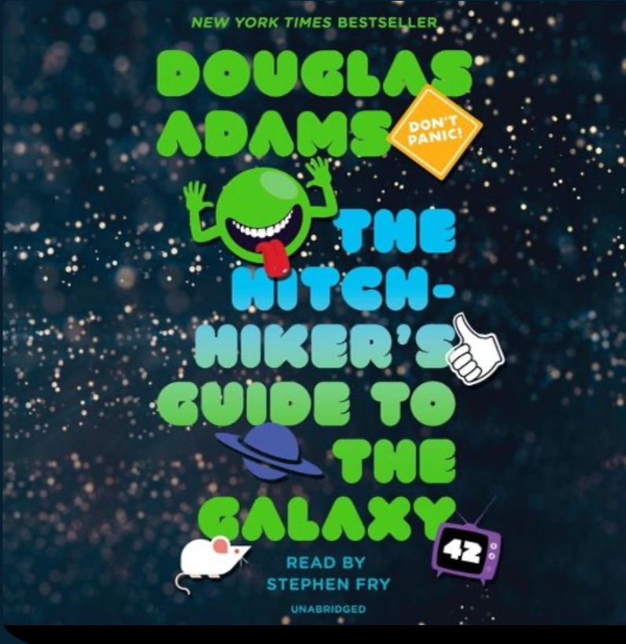

 

This is a classic. First time reading it and I love it. 

What I love about the storytelling:

> Declare something as unavoidably true, even if ridiculous, and build all content off of it. 

- Nobody cares that the infinity probability drive is absurdly improbable. But once the reader just accepts this as fact the rest of the story make sense. 

> get into the mind of the reader 

- sperm whale? I love when he's detailing the whales first and last thoughts. Just so random, but hilarious.  

> be spontaneous, but connected. 

- I recently watched the second season of Loki and couldn't stand it. It was all over the place. Random here, random there. But this is great because the spontaneity flows within the confines of the story.  
 
 
> logic, with social proof, can invert the mind 

- Arthur dent is flabbergasted by mice being the most intelligent species. Well the logic is sound: they were just fooling us and running experiments on us the whole time so we wouldn't think anything of it. This flip on expectation, backed by "isn't it obvious?!" gets the reader wondering for a second before they snap back to reality: no, mice aren't running the universe. 
