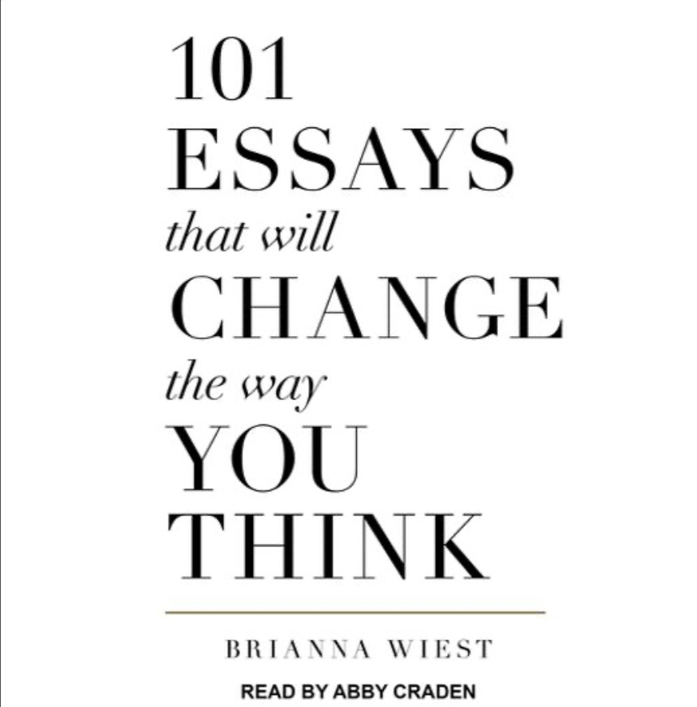

{.preview-image}

::: callout-note
## TL;DR: 101 ideas. This is like a modern day Meditations. 
:::

2023-12-19

- we all started as strangers 
- to change your beliefs, go have experiences that manifest and confirm the beliefs you want to have
- can only have a few truly 
- our relationship with others is a pure reflection of our relationship with our self. Work on your relationship with yourself to improve your relationship with others. 
- do you look at your leg and say "that's me?" No. That's my leg. Do you look at your eye, heart, hair? No. Do you look at your fears, hopes or dreams and say, that's me? 
- fear and Anxiety aren't feelings. They're symptoms.
- What emotion do you feel the most often? Is it positive? If not, why does a negative feeling deserve the spotlight? What does this tell you about your relationship with yourself?

