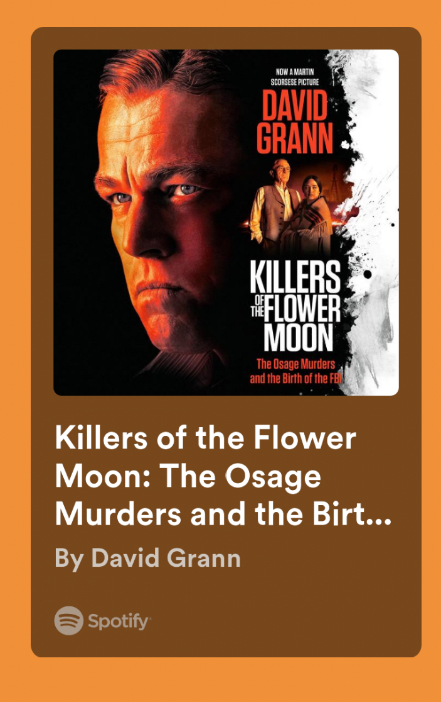

{.preview-image}

::: callout-note
## TL;DR: 
:::

[On Spotify](https://open.spotify.com/show/1RoZv5UYf6gRuekVmR5m0v?si=gCxmI1j_Q-ybcVFCAb5H9Q)

- Hale: self made man. Cowboy. Learned the trade. Got one cow. Then many. Then had 25,000 acres. 
- Ally. Used his position as a white guy to advocate on behalf of the Osage.  