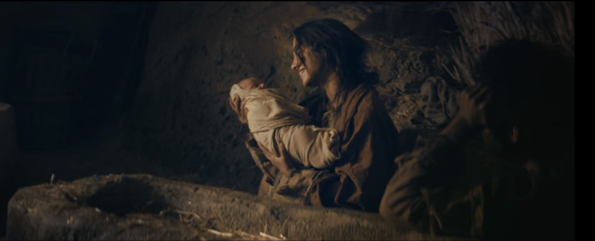
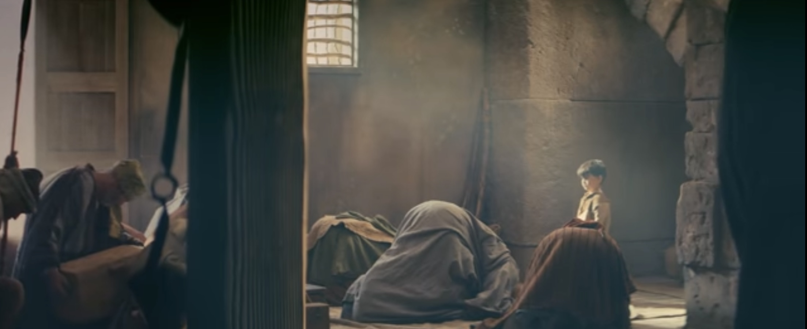

The story of the Savior's birth brings many wonderful concepts to memory and can teach us a lot about what will bring us true joy and happiness in this life. 

{.preview-image}

This is my favorite video of the Christmas story. The most powerful part is the moment when Mary sings a lullaby to Jesus. I remember reading somewhere that this moment was completely impromptu by the actress, and it speaks volumes to the sacredness of the moment where Mary first laid eyes on her beloved son. 



So what does this story give me perspective on at this time of year?

- Christ was the rightful, bloodline heir to King David's throne. He was the King of the Jews. But he never sought authority. He never sought a throne. He  instead taught ["Render therefore unto Caesar the things which are Caesar's"](https://www.churchofjesuschrist.org/study/scriptures/nt/matt/22?id=p17-p21&lang=eng#p17). He didn't engage in turf battles. In rebellion. In insurrection. He just wanted people to find happiness in their circumstances by living with lovingkindness in their hearts for their God, their neighbor, and themselves. 
- In his role as a Savior and Judge of the world, he sought to not condemn the sinner trapped in the act of sin. Instead he came to liberate. To forgive. To support. 
- If you believe Christ was the Creator and Savior of the world, consider how He chose to come into the world. He was born in a stable, mucked with animal feces and rotting food scraps, covered with the stench of...a stable. He was rejected of a room in the inn. He was laid in a manger, perhaps a feeding trough. Maybe Mary had help giving birth, maybe she didn't. He was born generally alone. I wonder if He chose to do his birth this way because nobody can say he had it easy. He didn't have the special treatment of a King's birth. No, he was born to an exhausted, weary traveler, likely on the cold hard floor of a dirty barn. 
- If we think about the Savior being the architect of this birth, think about how he planned for angels to show up to shepherds. Not King Herod. The shepherds. He would be the prophesied sacrificial Lamb. He would be the Good Shepherd. Yet these people were perhaps the minimum wage, forgotten ones outside the city gate. Yet these are those who had the privilege to see Him first. And He invited them to come and see. His whole life was an invitation.
- He also invited the rich wise men. All are invited. He wanted all to see, and he wanted the world to know that He was for everyone regardless their circumstances. And that all of us, whether destitute or traveling with caravans, can bring the gifts of our heart to Him. We don't need to bring gold. He just wants a ["broken heart and contrite spirit.](https://www.churchofjesuschrist.org/study/scriptures/bofm/3-ne/9?id=p20&lang=eng#p20)

How can we apply these things to our life, today?

- Seek out the forgotten. The people in our life that seem forgotten. The servants in our life (person on the other end of the customer support line, the checkout person, your supervisor) but even, your [best friend who seems to be doing great...](https://youtu.be/tX8TgVR33KM?si=Jdwq-B9W0dhWYhLA)
- Seek not riches or wealth. Harod sought these things. Christ sought relationships and truth. 
- Don't seek for power. Christ deserved it. Christ had it. He turned water to wine, cursed a tree, and made a host of  [men fall over at the sound of his voice](https://www.churchofjesuschrist.org/study/scriptures/nt/john/18?id=p4-p6&lang=eng#p4). Yet he didn't touch the Romans. 
- Seek to invite. To share. To uplift. Christ made shepherds feel important. He invited them to his crib side. And " his hand is stretched out still." (Isaiah 9:12)

He came like all of us, as a child. But he came to show us how a God would live. And he did. 

