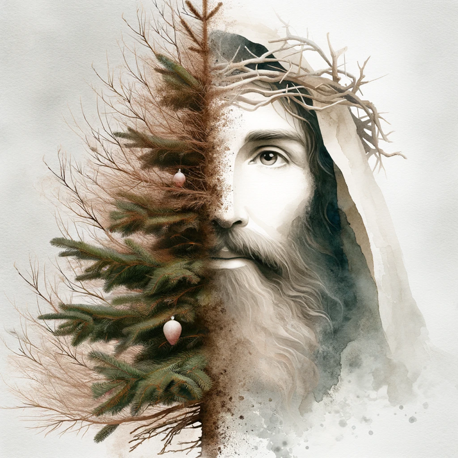

# An empty spot in the room

Just cleaned up the Christmas tree and all its ornaments and needles. The glittering, shimmering, and sparkling lights that have warmed us for the last month are officially gone. Packed up. Shipped out. Sent home. 

My child remarked, "it feels so empty without the tree!" I couldn't help but agree. 

The thought dawned on me, perhaps this is what the disciples felt once His light left the earth. Some accounts declare there was thundering and lightning and three days of darkness that covered the earth after He gave His life. 

# An empty room, an empty tomb

But just as His easily preventable departure left friends and parents weeping (because they didn't fully understand what He was dying for, ([Matthew 16:21-23](https://www.churchofjesuschrist.org/study/scriptures/nt/matt/16?id=p21-p23&lang=eng#p21)), perhaps we can remember a little of that sadness that they felt as we clean up the tree. The child was born. He was born to break the bonds of death. He died, some describing He died on a tree. And now, my pine tree representing Christ(mas) is also dead. 

> Who his own self bare our sins in his own body on the tree, that we, being dead to sins, should live unto righteousness: by whose stripes ye were healed. (1 Peter 2:24)

Perhaps it's also symbolic we cut down the tree to put it in our homes. It has an expiration date, just like Christ's life. He knew it was time ([John 13:26-27](https://www.churchofjesuschrist.org/study/scriptures/nt/john/13?id=p26-p27&lang=eng#p26)), even if nobody else could comprehend.

But remember what happened after? He resurrected. He brought His light back to His friends. 

Perhaps New Year's lights can remind us of His return. And perhaps a New Year's resolution can remind us that He invited His disciples to change their ways and go and preach to the gentiles (people previously not allowed to have His gospel and His gift of baptism and the Holy Ghost), to share the gift of Christ(mas) with everyone. 

The death of Christ marked the fulfillment of prophecy and the fulfillment of the Law of Moses, which meant that the Jews and the house of Israel were no longer the only ones chosen by God but now everybody could receive the gospel (Galatians 3:29). 

Let's take this new year to remember all are loved. All are remembered. All are invited to happiness and peace through Christ. 

{.preview-image}
 

