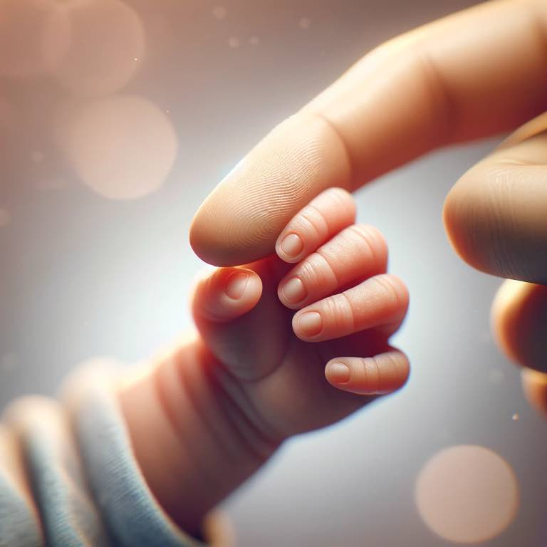

# Bound

```
My finger
Your hand
Once divided
United we stand

Ever bound
Your biology compels it
Cooing sound
A union I won't quit
```

{.preview-image}

The baby doesn't let go. Their grip on anything (even [Lint](../christianity/poem-lint.md)) is locked in. Only I can let go, which is a powerful idea. She's bound to me, trustfully so.