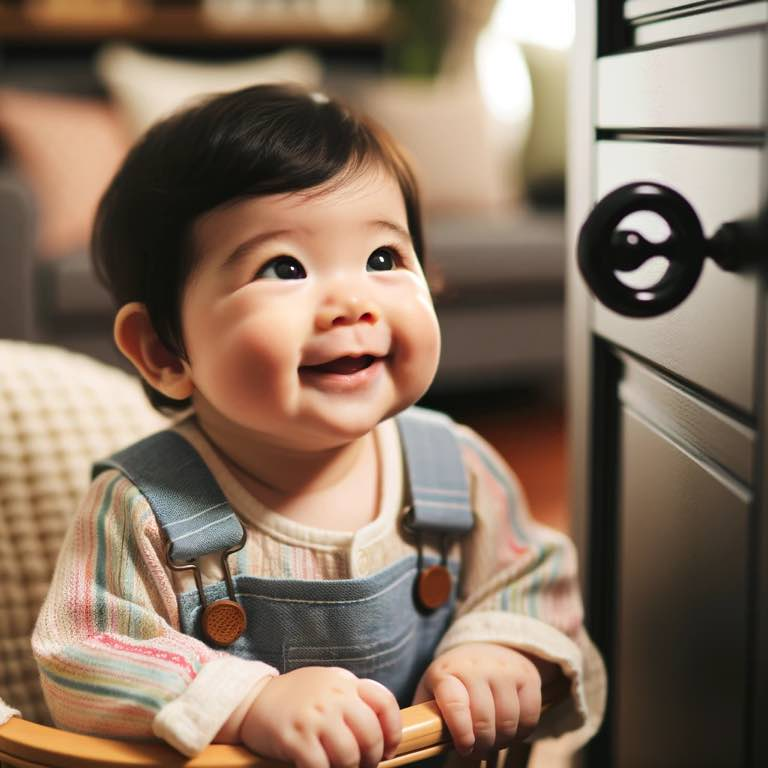

```
Hey you, over there
Black and shiny, half a square
Mind if I sit and stare?
As I rock in my chair?

Do you come here often?
Or is it just me? I sit here rockin.
Either way, my heart softens
You've got me smiling and I don't care
``` 

{.preview-image}

