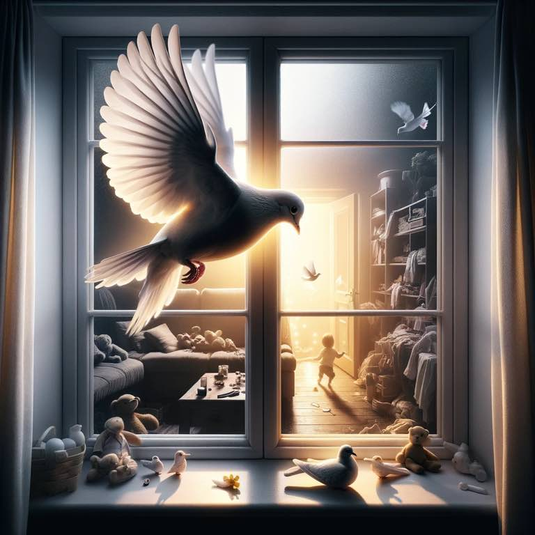

A twist on "[The Raven](https://www.poetryfoundation.org/poems/48860/the-raven)", by [The Best of Edgar Allen Poe](../book-review/the-best-of-edgar-allen-poe.md). Poe got it all wrong.

# The Dove (Forevermore)


```
Three A.M., I hear you wrapping.
Desitin, I keep slapping.
Diapers fresh, for poop, post napping.
Diapers fresh, for my Adore.

It was a cold and bleak December.
Dark and dreary, I remember.
Sleepless nights and occasional frights,    
I'd forgotten the parent's implore:    
  please protect my Sweet Adore   

Nothing strange, just parents living.
Babies growing, always swimming
through the tides of life they're dipping,    
  dripping, 
    tripping, slick socks 
        slipping    
    lovey, pants, they all keep ripping    
"Will it stop?", my mind weeps tipping
I love them so, my Adore.   
But I just ask rest, I implore.    
Will I get it? 
  "Nevermore."    

What's that I hear, is something slapping?    
No! by Jove! A creature crapping!    
Crapping on my kitchen floor!! 
Right next to the. bathroom..door...   
I just cannot believe for sure.
Not another chore.
I just mopped there, I can assure.
I feel denial swelling more.
  *That* creature must be *her* Adore.  


Then in Jan the rain starts stalling.  
On my chest, her eyes are falling,  
Napping, cooing, smiling, fawning,    
My bedroom window, in Jan is calling   
Calling in a creature, sure.

"What's this?" I wonder, as I slumber.
Is it just me, or am I dumber?    
Is that a bird?! What's that number?    
"Animal control!" I now thunder,
"For the dove! Not one mess more!!"
"Begone, you bird!" I implore!
It cocks its head, 
  "Nevermore."

Something changed, as I remember,
after that, cold, bleak December.
The sleep rolled in, and so I weather,
  weather just a little bit more.

The baby's coos I now see freshly.
The piqued smiles now enmesh me.
The drools of milk now refresh me.
Refresh me, my Adore.
How could I ever
  have seen anything more?
    Please don't let it end, I implore.
The dove then whispers, 
  "Evermore."

The children calling, wailing, falling
at my feet, screaming, brawling,
incessant thumping, pounding, hounding,
  is pleasant to my ears once more.
Pleasant because they're my Adore.

I see it now, that bright December.
It wasn't dark, I now remember.
Just a dog, a fog, but nothing more. 
But now it's gone, and nevermore.
I took photos, Polaroids, sure.
But now it's gone. 
  And I want more. 

Remembered now are the cuddles.
Long forgotten: spilled milk puddles.
Spilled milk puddles are 
  nevermore. 

Days asleep and nights awake.
Dream eyes open, for goodness sake.
What I wouldn't give to take
another look at my Make.
Another look at my Adore

When I could hold her, and nothing more. 
When in my hands, and on the floor
we cuddle, huddle, muddle more.
Bring it back, I implore
Turn back time, I plead sure.

Then entered in that dove once more, 
the welcomed bird, the dove of yore.
"The past is gone, time gave its seal.
But yours to keep, for it is real
past and present, space time is traveled
In eternity, your gift unravels
  Forevermore."
```

The tides of parenting are just phases. The good, the bad, the guilt, the love, the denial you even have kids to the overwhelming joy you could never express adequately in words...it all comes and goes - sometimes within the same hour. 

Then suddenly we realize it's all gone before we can blink.

The newborn is now walking at my feet. The eighteeen-month-old-diaper-generator is now riding his bike. The four-year-old brother slapper is now six and creating "Daddy, I love you" cards. Thankfully families are forevermore.

*(Mostly) written 5:02am after a sweet midnight feeding, where she cooed and smiled right before passing out peacefully on my chest.*

{.preview-image}
