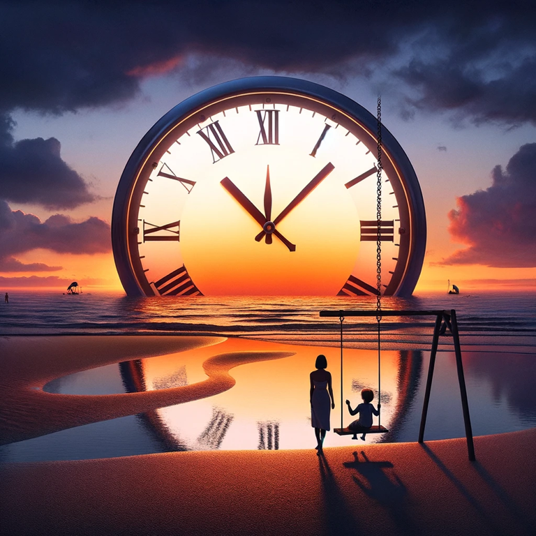

## Timeless

```
The days pass by like weeks.
The weeks pass by like days.
The sun continues to set
in it's old, familiar way


Time is an illusion,
restful nights, a delusion, 
my state of mind, a confusion,
But still my kids want to play
```

{.preview-image}