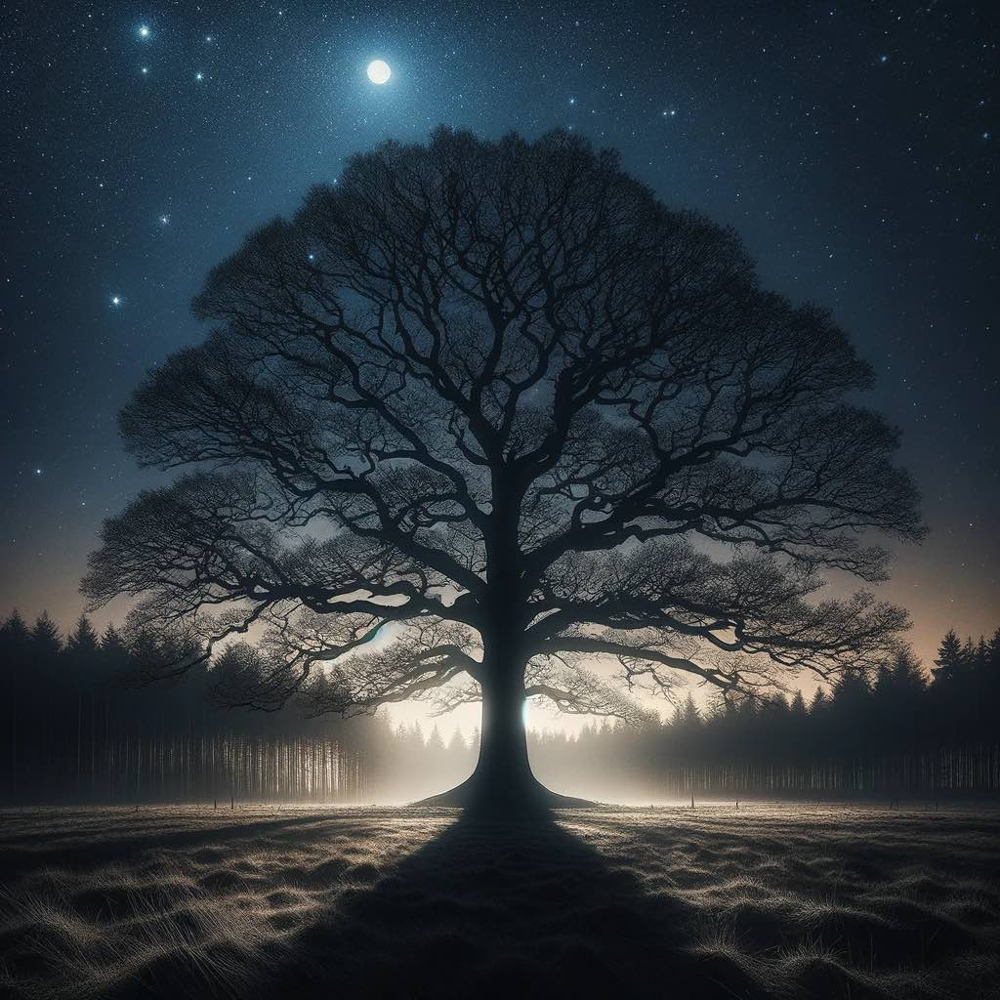

# Nuzzle

It's a strange thing. I can't help but wonder if she knows what's good for herself. But there she is, doing what she knows best. Night after night, more drinking. 

Her eyes roll back and I can see the eyelids bulge slightly. She's quite far gone at this point. I don't mind. 

I lean in and kiss her head. She lets out a little groan and drool drips out of the corner of her mouth. She leans in and falls on me. I let her. I nuzzle in. This is how it's always been between us. You'd figure I'd find a way to work through it but we don't talk much. It's never really been her thing. And so here we are, night after night and I find myself talking care of her. Just more drinking and sleeping. She doesn't even eat. 

But that's how it it's always been...I've been in love with her since we first met a few months ago. When I found her she was helpless. Just laying there, crying - not knowing where she was or what her name was. So I gave her one. And in time she'll call me dad. 

{.preview-image}
***
Reading [The Sun Also Rises](../book-review/the-sun-also-rises.md) right now and can't help but think of the association. But with a twist. 