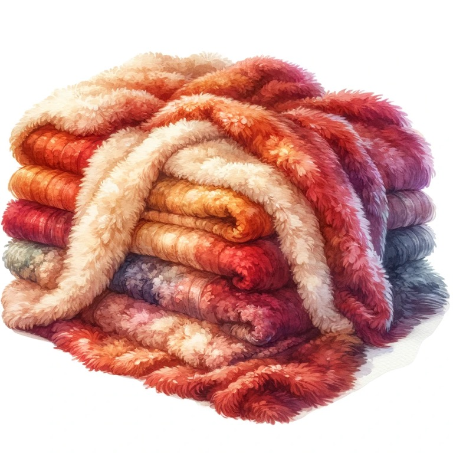

{.preview-image}

I'm outside right now enjoying the warmth of a blanket. It's a special thing. It's warm. It's fuzzy. And the only question I have is: is it warm because it's fuzzy? Or is it fuzzy because it's warm?

In the Hitchhiker's Guide to the Galaxy the most important item any many could carry was a towel. It's a multifaceted tool. Perhaps a blanket is the towel's cousin. 

My grandma loved to quilt, so me and all my family have hand crafted blankets. Even great grandchildren have blankets long after my grandma deceased because she had a surplus in her basement. 

There's something special about being wrapped in something warm, especially if it's made by someone who loves you. Kinda sends a special hug in a way that a towel just can't.   

