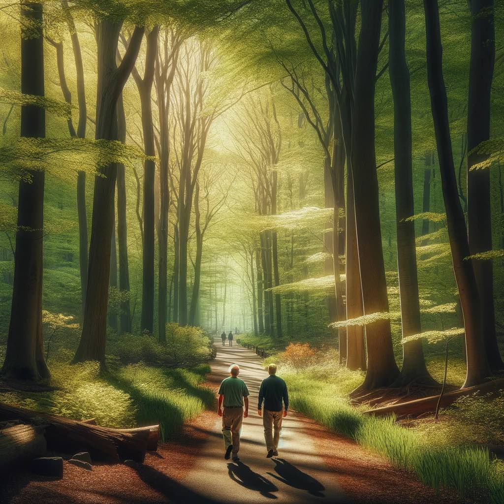

I've had a lifelong mentor, Daron Shepard, for nearly two decades now. We first met when I was a sophomore in high school and he just joined the high school coaching staff. 

Our relationship since that time has been many one on one phone calls. Sometimes he's called me when he didn't know how much I needed it. 

And today he's been calling me as a professional coach. Each time I talk with him I come away with better ideas on how to see things more clearly. 

He's like the giving tree. I keep coming back to him at different phases and he keeps helping me in new ways. 

{.preview-image}