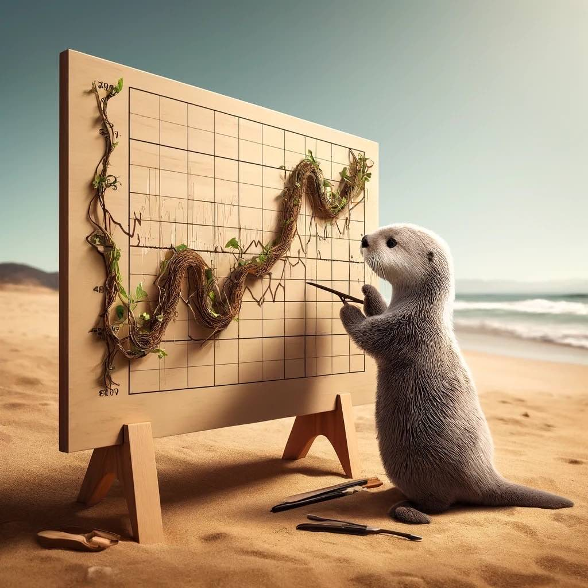

Joining my current company has been pretty great. Here are the things I've liked about it so far:

- people are kind. 
- They're open to each other's ideas. 
- They invite each other to lunch in big parties. 
- They laugh
- They encourage each other 

It's just a positive place. Where does this come from? It can only come from the top. 

Reading [Thinking, Fast and Slow](../book-review/thinking-fast-and-slow.md), there's a strong correlation between creative thinking and happiness. Having read things like [Elon Musk](../book-review/elon-musk.md) and [Steve Jobs](../book-review/steve-jobs.md) and one of the conclusions in the Elon book is "working for jerks is perhaps a necessity to get their high level of thinking." There's also the set of people who don't want to work like that - where they treat each other with kindness and respect. 

Here's to my coworkers and those who created the work environment where people who are kind thrive. 

{.preview-image}