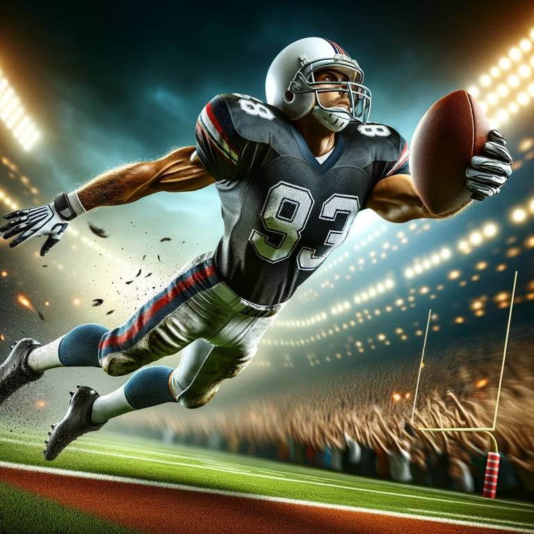

When I was a kid, I broke my wrist. I no longer would be able to play football. It was my senior year, the year where all the magic happens. The year you prepare for. The big leagues. 

My mom told me, "when a door closes, open a window. This if life". 

A new perspective is an opportunity to see something that was there all along, but because of myopia you didn't previously see it. 

{.preview-image}

Perspective is realizing that senior year wasn't any more special than the junior year where I had fun on JV. Perspective is realizing it's just a game. Perspective is years later realizing that something I cared so much about at the time now has little value or importance in my life, and other things have far more importance to me. 