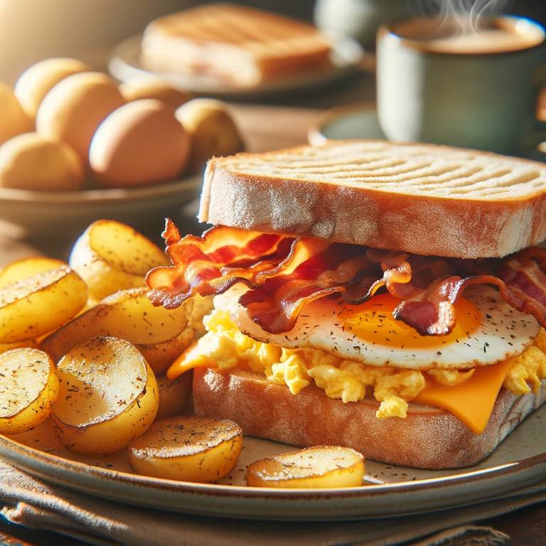

I grew up in a suburban town in Connecticut. Italians and their amazing propensity for delicious food and sandwiches seemed to flood the streets. 

A brilliant chicken salad melt that truly melts in your mouth. 

A chicken parm from D corner deli that would energize you from lunch through dinner - a classic among rabid pubescent football players. 

Adding "con papas" to any "BEC" meant you were in for a filling treat. It was the insider's secret menu item, and the man behind the counter knew you had good taste. 

{.preview-image}

What happy memories. 

