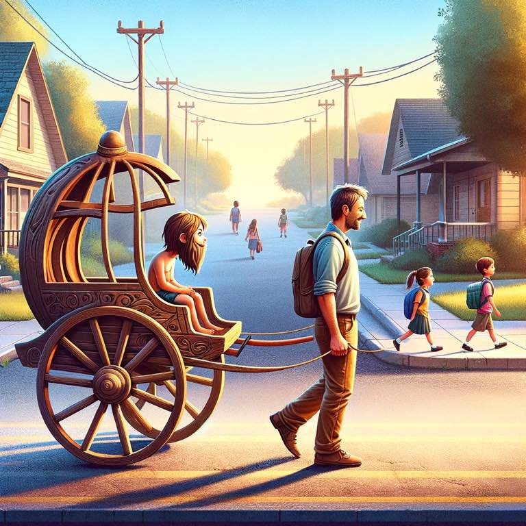

> Plop them in, buckle them up. Go on a run, give them a cup.

Strollers are how I take my kids to school every day. I strap them in (or they just sit down), and I hop on my Onewheel and we go on a ride.

10 m.p.h., the wind in our hair, the cars waiting behind us because we're fast enough and wide enough that they can't pass us. All of this is good.

My kids get to see more of the world faster, even if that world is just here to school. My non-school kids can get out for a minute without a huge hassle on my part.

The best part is: the stroller rolls. I don't have to drag it. I don't have to slog it. It's not a 50lb brick. It's got wheels. The marvelous creation of the near frictionless geometric phenomena that is a wheel.

So I guess I'm also grateful for wheels and chariots. Thank you to whomever invented these things thousands of years ago.

{.preview-image}
