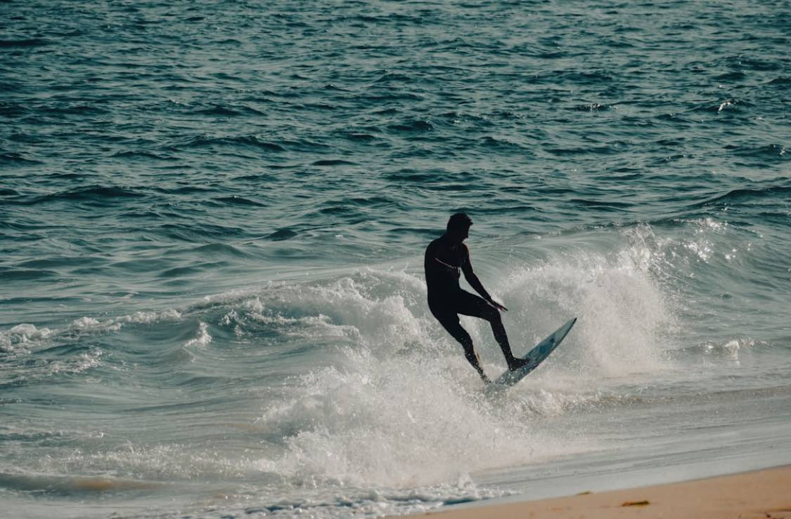

I only had 10 minutes to skimboard today. But I saw this little flat spot off to the side, where the waves were receding slowly. It looked perfect. 

First one or two were a bit slow. But then I started to pick it up again. Pretty soon I was running compulsively to the next wave, just like when I was 22 when I really learned. 

{.preview-image}

Then I had a great run. Hit the crash of the wave as best as I've ever done it. Didn't wipe out. Just a great, energizing feeling. 
