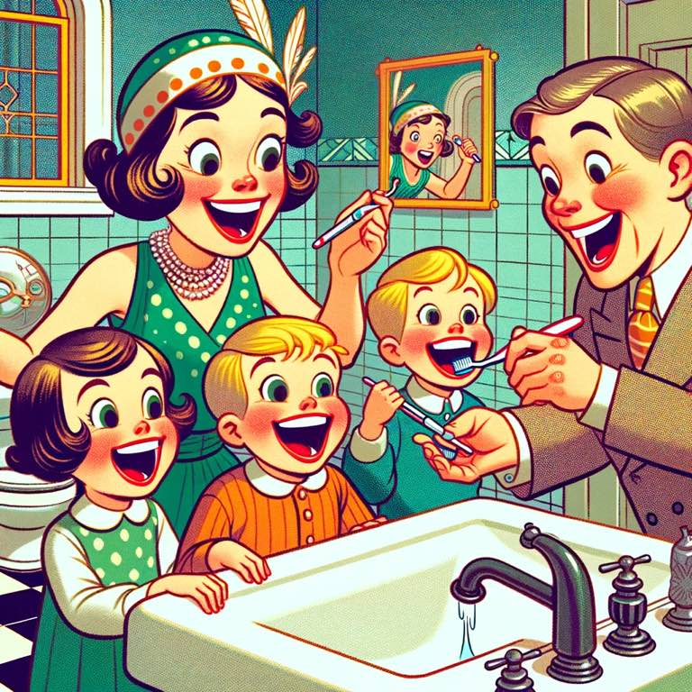

Is there anything more refreshing than brushing your teeth? Anything less satisfying than going to bed without brushing your teeth (camping, airplane ride?)?

Brushing my teeth is a gift. And I know it prevents problems (cavities, disease, etc). It also enables me to have more sugar, which is probably bad for me but I enjoy regardless. 

In [The Power of Habit](../book-review/the-power-of-habit.md) and learned about this great fact about tooth brushing (summarized by ChatGPT):

> Yes, "The Power of Habit" by Charles Duhigg does mention toothpaste. The book discusses how toothpaste companies, particularly Pepsodent, leveraged the power of habit to increase their product's usage. Duhigg explains how Pepsodent created a daily habit for people by associating the use of toothpaste with the tingling sensation it produces, which wasn't common in toothpastes before Pepsodent. This case study is used to illustrate how cues and rewards can create lasting habits.

Pepsodent and their marketing team in the 1920's changed life for us all. Same goes for body wash, hand soap, and other soaps - they put the bubbles in them to make us think it's "working". 

But I also like bubbles. Who doesn't like bubbles? Toothpaste has bubbles. What a gift. 

{.preview-image}