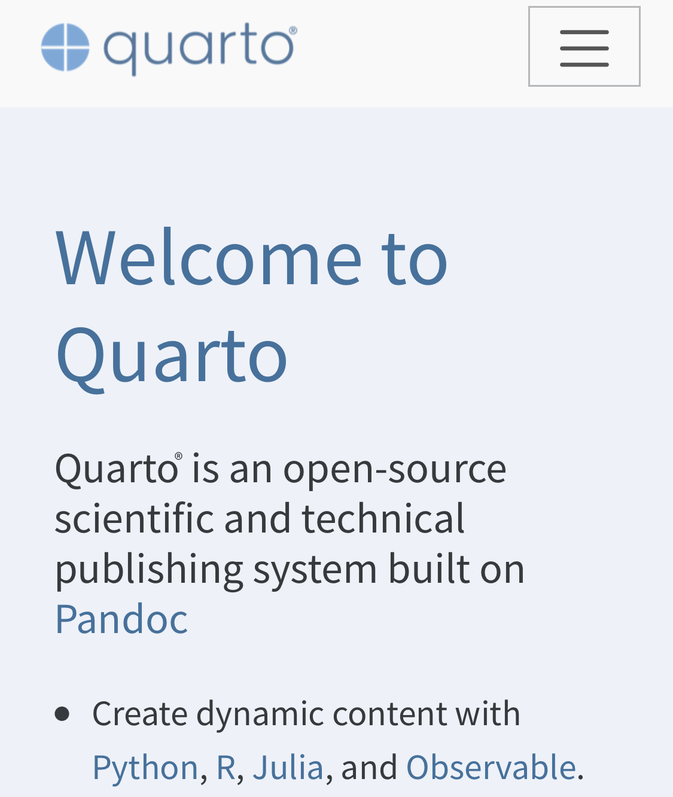

	
# Been here before, eh?

I probably shouldn’t write this post considering I’ve also written posts "blogging with Jekyll", "Blogdown", and "distill" before. I’m flaky, what can I say. I’ve changed my blogging framework 7 times in 5 years (I started with blogger.com and Wordpress before Jekyll, and even used Medium for 25 posts.)

But it’s not my fault. There are too many static site generators and it seems that Rstudio is as flaky as me. Meaning, they built rmarkdown, created hugodown, blowdown, bookdown, and distill. Hugodown is a lightweight version of blogdown, and I never figured out why it exists. Then there’s workflowr and so many other great, random products out there. 

Why quarto for me? It seems to have all the stuff that distill has, and then some. And given its design and collaboration with Wes McKinney (pandas guy) in building quarto, and given that Wes wrote his latest book with it, I think this will be here to stay for at least 5 years. 

# Why do I avoid Medium
Why don’t I blog with Medium? I wrote 25 posts there over 9 months and loved it. It makes writing and publishing incredibly easy, which is why I did it. With distill/blogdown the limiting factor was I’d have to be at my computer to get a post in. I love writing on my phone - I have over 2000 journal entries with Day One over seven years, several of which are "draft" posts for a blog that won’t see the light of day since I don’t care about them after I’ve written it. I want to be able to blog frequently, a short little blurb to keep up my writing, and medium enabled this. 

But 1) I didn’t get many views (not that I care) and 2) my writing is stuck on their platform (confirmed to me this week as I’ve tried several old, broken tools that attempt to export posts out of medium). 

I got 50x the views on my blogdown site just from organic google searching. From reading other people’s [posts](https://hulry.com/medium-vs-own-blog/) about leaving Medium, it’s seems that most traffic to Medium posts comes from outside of Medium. 

So while I’m certainly not into blogging for the money, I wouldn’t mind getting the content to people who it can help. And if medium didn’t enable this, what is its purpose?

So I’m back and finally decided that I’m going to own my own platform. Seth Godin wrote a blog about this topic once. Why be on Medium, substack, Facebook, etc or any other up an coming platform? We’ll they’re all skewed toward the 1% of people who make money on the platform. Everyone else is wasting their time. So might as well own your content. And better to focus on writing than waste time catching up on every platform. 

Also, it’s fun! There’s a fuzzy feeling to blogging. 

# Future of quarto?
I’m speculating here, but [Quarto can be used with ](https://quarto.org/docs/get-started/)R Studio, Jupiter or VS Code. The last editor seems excitingly suspicious. 

Perhaps R Studio sees the writing on the wall that VS Code is taking over the IDE world and perhaps taking over the long term future of R Studio IDE. I personally don’t see why anyone would pay for R Studio when VS Code is free and has a better interface. And while R Studio has a few better integrations for R at the moment, it won’t once enough people see the light for VS Code and turn their contributions there. I’ve been using R on VSCode for two years now and it rivals R Studio in 95% of the feature set, but 100% has better window management. 

So Quarto seems like a great opportunity for R Studio to begin monetizing on a publishing platform like R Studio connect.  Platforms like Notion and Confluence are great for everyone except data scientists trying to share reproducible research. But a quarto server seems like a great way to finally bring in Python data scientists into the markdown-flavored documentation world. (Man, I personally can’t use Jupyter/Google colab notebooks when I can use R Markdown!) I’d heartedly welcome this prospect, though I have no idea what their plans for Quarto really are. 

Till next blog post about what blogging tool I’m going to use...

