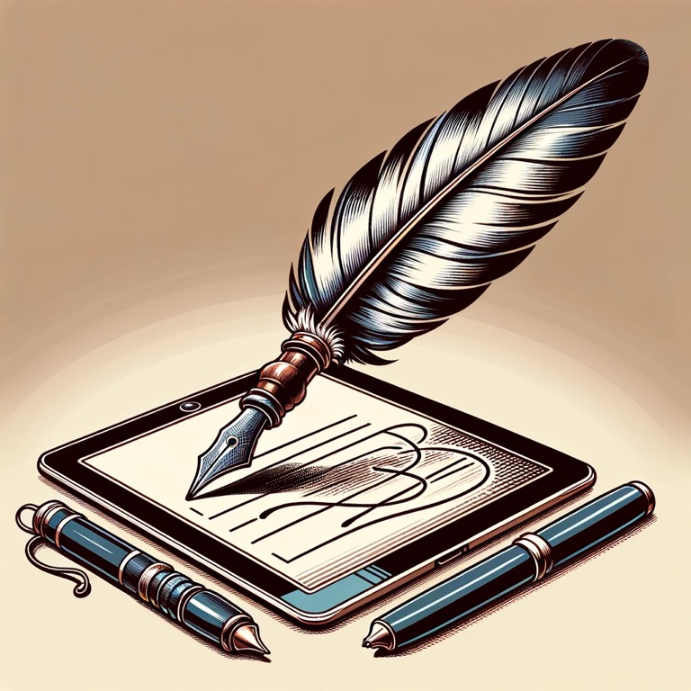

I’ve recently read “Atomic Habits”, “Deep Work”, “The Power of Habit”, “Getting Things Done”, “Essentialism” and “Effortless”. These productivity paradigms influence this post. 

Inspired by [this Reddit post](https://www.reddit.com/r/ticktick/comments/v5n3x4/how_do_i_use_ticktick_lists_and_tags/?utm_source=share&utm_medium=ios_app&utm_name=iossmf), I’ve tried thinking how I want apply the principles of GTD and these other paradigms. I think GTD is great for me because it helps me get ideas out of my head and Essentialism is a better pursuit to make sure I’m not caught up in minutia. I don’t see them as incongruent, but one as an ideation organization approach and the other as a relentless focus. 

Five steps of GTD:

1. Capture 
2. Clarify
3. Organize 
4. Review 
5. Engage 

# Capture

I have an iOS shortcut that lets me quickly add a TickTick task to my inbox. I put this on my Home Screen for instant access and to avoid distraction. I want to capture the idea, not open TickTick and get distracted by other ideas. 

Or I use the TickTick today widget and upload it to today directly. Depends on the task and how detailed I want to be. 

# Clarify

Here’s the system I use to clarify.

Definitions:

* Task: an action item. 
* Project: an intended outcome with multiple tasks. 
* Epic: an intended outcome with multiple projects. 
* Key Result: high level, long term accomplishment. (Increase revenue 10%)
* Objective: a squishy, feel-good purpose statement. “Deepen relationships with loved ones.”

Task grooming process: Groom the inbox every night and identify the intended outcome and next action. Tag the task. 

  * If the task was “send Birthday card”, that’s really an intended outcome and is a small project. The tasks are 1) buy card from CVS, 2) put in envelope with stamp, 3) drop in mailbox. These three subtasks need to be understood. But a separate inbox entry may be “pay phone bill by sitting down at my computer at 10pm”. This isn’t a project. It’s just a one off thing. But it can still be clarified with details. 
  * Label if it’s a project or not. Use iOS shortcuts to make this really easy. For example, gg = “🎯 #Project”
  * The challenge is if I should have things as projects or as individual tasks. I would say that as much as things can be independent, keep them tasks. Like “apply for credit card1” and “apply for credit card 2” are both personal finance tasks. But they are independent. 
  * A task isn’t necessarily short and a project isn’t necessarily long. It’s just whether this Indy ended outcome has multiple steps or not that might be done over a few days, whereas a task is probably done in one sitting. 
  * It’s assumed that unless something is a task, it’s a project. 
  * Every epic has its own name. I nest epics under “Work > #Epic1, #Epic2”, etc. This helps me organize my work deliverables. I have like 5 epics right now at work that will span several quarters. 

Then I may choose to add tags with metadata, which I haven’t figured out if this is useful yet. But “Atomic Habits” says the best way to get stuff done is to stack it. So here is my tagging system to help me stack:

* Commitment: ASAP, Eventually, Someday Maybe. Will I do this task eventually? Pay a bill - yes. Learn a language - someday maybe.  
* Duration: 5min, 30min, 1hr, 2hr, 4hr. 9hr (all day)
* Location (where to do the task): Home, Desk, Car, Backyard. Most work things are done at my desk. But perhaps some can be done while taking a walk. Most personal things are done around the house or on the couch at night. 
* Time of Day: “1: Pre work”. “2: start of workday. 3: lunchtime, 4: afternoon, 5: after work, 6: nighttime”
* Focus: “Deepwork” or “shallow”. Deep work should be uninterrupted and be 3 hours long. 
* Severity: S1: if I don’t do this nothing will happen. S3: not doing this will have bad consequences or lots of regret. S2 - in between :). 
* Deadline: I’m still thinking about this one. To me there’s a difference between mowing the law which has a linear cost of looking worse each day for not being cut and failing to pay my taxes, which has festeringly worse consequences the longer I put it off (pay a fine, end up in jail, etc.). I guess this is captured implicitly in “ASAP” commitment. But paying my taxes is only a cost (preventing negative outcomes) versus the ASAP of getting my project finished (positive consequences). 
    * None (default): no consequence for never doing this. 
    * Binary: You either make the deadline or never and this opportunity ceases forever. 
    * Rolling: If you miss the deadline there will be another. 
    * Festering: the longer you put this off the worse it becomes, but no deadline. 

As I write this, this sounds like overkill…classic me. I sincerely doubt it’s useful to of all of this. But having the system available will let me use what I need when I need it. If I’m still using any of this in a month that’ll be a miracle. But I’m going to start with something in mind and go from there. 

# Organize

1. Once clarified, move out of inbox into a list “work” or “personal”.[^1] 
2. Prioritize. 
3. Delegate. (Myself, someone else.)
3. Assign due dates and times (if not already done)

[^1]: Tags and lists are identical except Lists have sections and views (such as Kanban). In a list you can sort by tag and vice versa. But each task can only appear in one list whereas tags are infinite. I noticed that choosing which list something belongs to can be cumbersome if it’s in a nested list, so I want only high level lists (no folders) and have this be simple. I also have “personal” and “work” tags which have projects within them, so I don’t really see why I’d need to duplicate this. On second thought, each task can only belong to one work project so it’d make sense for this to be my grouping. I suppose I just don’t want to manage all that. Or, I chose to use tags to manage my projects because I was cheap and I can only have 9 lists on the free version but unlimited tags? Either way this is easy to reorganize later if I choose to switch. Tags it is for now. 

# Review

* Each night I will review the days tasks and re-prioritize as needed.
* Pin the one task/project I want to get done that day.
    * Essentialism says to take the 6 tasks of the day and choose just one. Then identify what else you need to say no to to ensure you have the energy to accomplish that task. 
* Weekly planning session to review all of this. 

# Engage 

* Don’t work on any tasks in a day/week that weren’t planned for that day (unless something comes up). 
  
# Final Thoughts

A task system should be saving me time, not consuming it. It should be relaxing me and my anxieties, not amplifying them. I’m going to give this 30 days and see if my stress decreases and productivity increase. If so, I’ll keep using this system. 

GTD states that by _not_ writing down all the ideas, you waste energy because things come back to nag you later. But surely energy is wasted by organizing a valueless idea. 