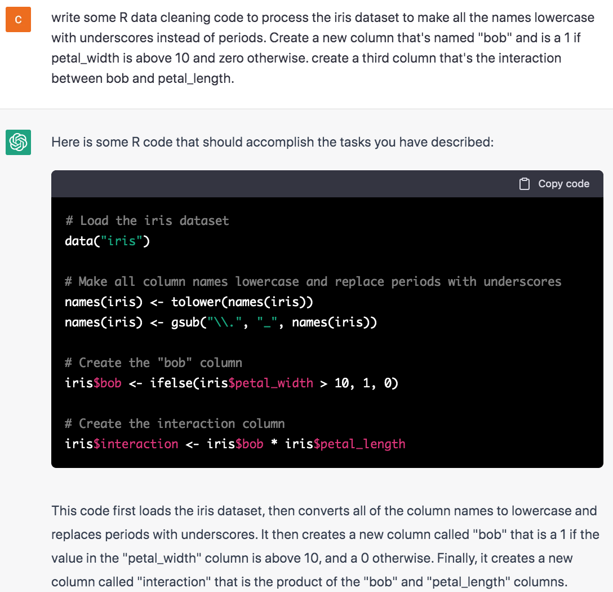

[ChatGPT](https://chat.openai.com/chat) is nothing short of amazing, but I think I'll still have a job as a data scientist for at least another year or so. 

# Goal

In this post, I'll walk through the hour conversation I had with ChatGPT to build an R Shiny dashboard. My goal was to see if it can load in real-time data, do time-series forecasting, and visualize the results. For the most part, it could. Let's dive in.

First, I was inspired by this post:

<blockquote class="twitter-tweet"><p lang="en" dir="ltr">And here is the final result. A fully functional shiny app without actually writing a single line of code, built in under 3 minutes.<br><br>Wondering how it handles more complex queries, but still, this is insane. <a href="https://t.co/LepjcMNk43">pic.twitter.com/LepjcMNk43</a></p>&mdash; Jose Fernandez (@jfernandez__) <a href="https://twitter.com/jfernandez__/status/1599470625910706176?ref_src=twsrc%5Etfw">December 4, 2022</a></blockquote> <script async src="https://platform.twitter.com/widgets.js" charset="utf-8"></script>

# Building a Dashboard

My prompt was this:

> Build an R shiny dashboard that uses a package to read in stock prices for AAPL and uses the prophet library to forecast the stock 6 months into the future. Visualize the data in an interactive plotting library with a slider window on the plot to zoom into different time periods. 

And it gave me line-by-line instructions:


I asked it to consolidate all of that into one script, which produced this: 

```
# Install and load the necessary libraries
install.packages("prophet")
library(shiny)
library(prophet)
library(tidyverse)
library(dygraphs)

# Read in the stock prices for AAPL
getSymbols("AAPL")
aapl <- as.data.frame(AAPL)
aapl <- aapl %>% select(date, Adj) %>% rename(y = Adj, ds = date)

# Fit a model to the stock price data
m <- prophet(aapl)

# Forecast the stock price 6 months into the future
future <- make_future_dataframe(m, periods = 180)
forecast <- predict(m, future)

# Define the user interface
ui <- fluidPage(

  # Add a slider input widget
  sliderInput("window", "Time Period:",
              min = 1, max = length(aapl$y), value = c(1, length(aapl$y)), step = 1),

  # Add a dygraphs plot
  dygraphOutput("plot")
)

# Define the server function
server <- function(input, output) {

  # Reactive expression to create a subset of the data based on the slider input
  stock_subset <- reactive({
    aapl[input$window[1]:input$window[2],]
  })

  # Render the dygraphs plot
  output$plot <- renderDygraph({
    dygraph(stock_subset(), main = "AAPL Stock Price") %>%
      dyRangeSelector()
  })
}

# Run the Shiny app
shinyApp(ui = ui, server = server)
```

Pretty impressive start, to be honest. 

# What ChatGPT gets right
A few days ago I asked it to create an R Shiny app that could load in the iris dataset and create an interactive table.  It did that with ease, as the twitter post above shows.

I then asked it to "re-write me that same app, but using python's [h2o-wave](https://wave.h2o.ai/docs/examples/dashboard)". [As an R Shiny user, I'm curious to have a compelling python replacement. I know there's [python shiny](https://shiny.rstudio.com/py/), but I love [streamlit](https://github.com/streamlit/)'s simplicity and think h2o-wave is more robust than streamlit.]{.aside} It was able to build me a simple app.

Today, when I asked it to build me an interactive visualization after building a time series forecasting model, it could get me all the core components. It only struggled on data inputs/outputs. The app would break and I'd ask it some questions, which it could sometimes answer, and would sometimes mislead me.

For example, the first error I got was :
> I'm getting the error ```Error in getSymbols("AAPL") : could not find function "getSymbols"
```

ChatGPT replied:


It even adjusted my code and put the installation steps at the top of the script. Amazing.

## Data Processing

I asked it to create an indicator variable for me so that I could color my dygraphs chart by forecasts vs. historical:


Here was my prompt:

> Don't use `add_series()` since you're wrong and it's not a function in dygraphs. Instead, append the forecasts to the aapl in the stock_subset function and create a new indicator for the forecasted values where 0 is past data and 1 is forecasted data. Then, color the dygraphs chart based on the indicator value. Re-write this script below accordingly.

Look at that code! It knew to filter `appl2$ds > max(appl$ds)`. That's exactly how you subset a prophet dataframe (which returns all historical and future forecasts in one dataframe). It knew that `appl` was the first dataset and `appl2` was the derived dataset. It knew that it had to take the max date from `appl`. This is absolutely amazing, hands down.

```
aapl2 <- bind_rows(aapl2, forecast_subset)
aapl2$indicator <- ifelse(aapl2$ds > max(aapl$ds), 1, 0)
```

# What it got wrong

ChatGPT won't put me out of the job for a bit, though. (Like at least 6 months maybe?)

## Data inspection
I then got this error:

```
I'm getting this error: Error in `select()`:
! Can't subset columns that don't exist.
✖ Column `date` doesn't exist.
```

ChatGPT gave me the ring-around. It didn't know that the dates were stored as the rownames, but confidently gave me answers like this:


To it's credit, it recommended I inspect the data myself:


Once I figured out the problem, I told it that the rownames were dates, and that date wasn't a column. It had just the solution for me:


## Misleading Functions 

Twice, it told me that `dygraphs` had functions that it didn't actually have. It even wrote code for me. For example, it recommended this to me:

```
dygraph(stock_subset(), main = "AAPL Stock Price") %>%
  add_series(data = forecast_subset, col = "red") %>%
  dyRangeSelector()
```

And it doubled down:


## Data Conversion

It told me to use the `xts` package so that `dygraphs` could read the data in. This was accurate - `dygraphs` cannot read in tibbles. 


But it was misleading me a little bit. Again, I had to look at the data, because the direct code it gave me was missing columns that it assumed it had.

# Final Product

After a little bit of love, here's the output:


```
# Install and load the necessary libraries
# install.packages("prophet")
# install.packages("quantmod")
# install.packages("xts")
library(quantmod)
library(shiny)
library(prophet)
library(tidyverse)
library(dygraphs)
library(xts)

# Read in the stock prices for AAPL
getSymbols("AAPL")
aapl <- as.data.frame(AAPL)

# Convert the rowname (date information) into a column
aapl <- rownames_to_column(aapl, "date")

# Select the necessary columns and rename them
aapl <- aapl %>% select(date, AAPL.Adjusted) %>% rename(y = AAPL.Adjusted, ds = date)
aapl$ds <- as.Date(aapl$ds)

# Fit a model to the stock price data
m <- prophet(aapl)

# Forecast the stock price 6 months into the future
future <- make_future_dataframe(m, periods = 180)
forecast <- predict(m, future)

# Define the user interface
ui <- fluidPage(
  
  # Add a slider input widget
  sliderInput("window", "Time Period:",
              min = 1, max = length(aapl$y), value = c(1, length(aapl$y)), step = 1),
  
  # Add a dygraphs plot
  dygraphOutput("plot")
)

# Define the server function
server <- function(input, output) {
  
  # Reactive expression to create a subset of the data based on the slider input
  stock_subset <- reactive({
    aapl2 <- aapl[input$window[1]:input$window[2],]
    # https://stackoverflow.com/questions/4297231/converting-a-data-frame-to-xts
    # 
    forecast_subset <- forecast %>% select(ds, y=yhat) %>% 
        filter(ds >= "2022-12-15")
    aapl2 <- bind_rows(aapl2, forecast_subset)
    aapl2$ds <- as.Date(aapl2$ds)
    aapl2$indicator <- ifelse(aapl2$ds > max(aapl$ds), 1, 0)
    aapl2 <- as.xts(aapl2[, -1], aapl2[, 1])
    return(aapl2)
  })
  
  # Render the dygraphs plot
  output$plot <- renderDygraph({
    dygraph(aapl2, main = "AAPL Stock Price", group='indicator') %>%
      # dySeries(color = c("darkblue", "red")) 
      dyRangeSelector()
  })
}

# Run the Shiny app
shinyApp(ui = ui, server = server)
```

# Data Processing

After writing all the above, I thought, what else can it do? Here's a bonus.
ChatGPT can understand and do mundane data processing very effectively:



# Takeaways

To get from the first script to the second script took an hour. If I didn't already know shiny, and didn't already know data processing, or know what it was looking for, then some steps would have perhaps been impossible.

ChatGPT is amazing at:

- Boilerplate code
- Pointing you in the right direction with code snippets (like a way more useful Wikipedia)
- Taught me packages I had never used before (`dygraphs`, `xts`)
- Could write 95% valid Shiny code that did data visualization with timeseries data (not easy, even for an experienced programmer).
- Somehow mostly knows the data structures of `prophet` datasets, can make predictions, can filter the data
- Simple data processing (could create a smart indicator variable)

ChatGPT has ways to go with:

- Knowing everything about the code base (misleading code snippets)
- Not being so confident when it's wrong
- Debugging nuanced things. I think it conflated `plotly`'s API with `dygraph`'s when coloring series.
- The user still needs to know what questions to ask.

If ChatGPT actually had access to my data using a REPL (like could run `names(df)` itself and see the output), I'd be done for. How hard would that be, though? Technically, it'd be very feasible through some API calls.

too long; but read the whole thing: ChatGPT is going to be very powerful in 2-5 years. Data analytics is about to get disrupted.

See the full chat [here](convo.txt).


