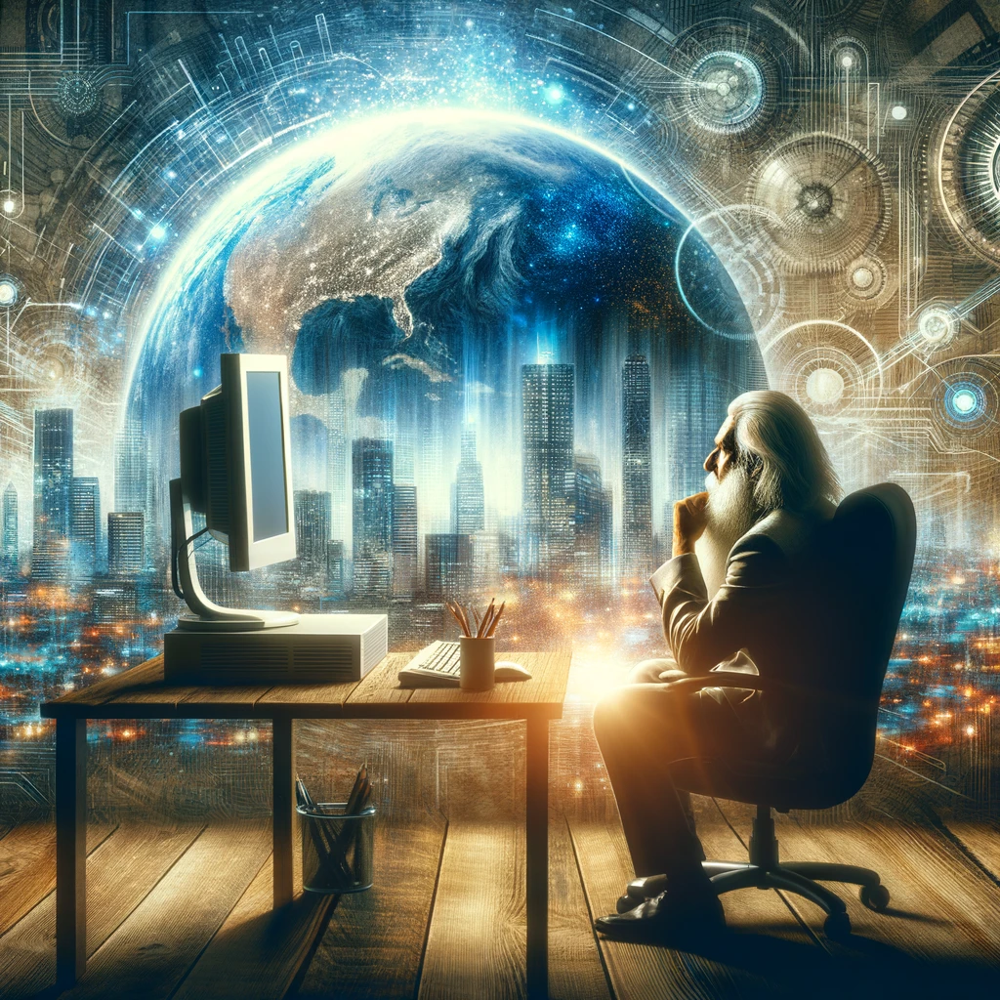

 

# The Essence

::: callout-note
## TL;DR: The future belongs to those whom it’s always belonged
:::

A blogger data scientist Santiago recently said on Twitter, (paraphrasing) “I’m going to focus on what won’t change”. He was worried about how coding and AI will be automated, but Jeff Bezos wasn’t worried about so much of the world changing with the Internet. Bezos focused on what wasn’t changing. 

This thought hit me, because I think it’s relevant to what our future looks like in 18 months. 

# Every day, a new winner

Nothings more apparent that the world is going to be wildly different than the past than to hop on X and see new academics one upping themselves with the next greatest LLM. Mistral just announced a 2Bn valuation as a 6 month old company. Fast is the new pace. And it’s oddly the case that big businesses are capable of massive disruption from upstarts. They can’t afford to stay glacial much longer (5-10 years). 

With all of this, what about this blog post won’t change? Well, the timeless principle is that the nature of the game has changed permanently. Pandora’s box was opened. 

# The rise of a new equalizer

Go into a poor part of town and you’re guaranteed to see one thing: poor people using smart phones. 

They have access to all the same information that the rich people have. The same excellent software. Same excellent hardware. All for a fee of $50/mo for the hardware and $25/mo for an unlimited data plan. 

So that out the rich and the poor on the same level. 

Well now, knowledge and reasoning is as accessible as Google Maps. You don’t have to pay $20/mo for ChatGPT plus. You can use Bing, Claude.ai, bard.google.com, You.com, or perplexity.ai for free. Now. 

Sure people hate on bard and want to use the latest and greatest. But even the crappiest of the four I mentioned above (granted Bing/You.com use GPT in the background), is still leaps ahead of where we were just a year ago. If we were stuck only using one of these tools forever we’d still be massively more productive than not. 

So knowledge and intellectual reasoning is going to be commonplace amongst the plebes. 



<blockquote class="twitter-tweet">
if you value intelligence above all other human qualities, you’re gonna have a bad time
&mdash; Ilya Sutskever (@ilyasut) <a href="https://twitter.com/ilyasut/status/1710462485411561808?ref_src=twsrc%5Etfw">October 7, 2023</a></blockquote> 

<blockquote class="twitter-tweet">
if you value intelligence above all other human qualities, you’re gonna have a bad time
&mdash; Ilya Sutskever (@ilyasut) <a href="https://twitter.com/ilyasut/status/1710462485411561808?ref_src=twsrc%5Etfw">October 7, 2023</a></blockquote> 

# More of the same

So…what’s going to happen? Well, I’m not sure human nature will change much. 

They say “being rich doesn’t make you happier. It just makes you more of what you already were before being rich”. 

And so, the mentally poor will remain so. They’ll use AI for entertainment. Better video games. Better, faster content. More consumption. 

The creatives will be more creative. Nobody will be at a barrier of being silo’d. So what if you’ve only done data science for 10 years. You know coding. It’s easy to now do web design. Or copy writing. Or art. Or… 

And I won’t be able to stop the masses from using Code Interpreter to do data science. The systems will only become more powerful, so cloud companies will make it easier to write sql or whatever. Heck, 5-10 years English will be the only programming language. (Who here does firmware/bit mapping anymore? Only a select few.)

<blockquote class="twitter-tweet">
The hottest new programming language is English
&mdash; Andrej Karpathy (@karpathy) <a href="https://twitter.com/karpathy/status/1617979122625712128?ref_src=twsrc%5Etfw">January 24, 2023</a></blockquote> 

Python programmers will become like the engineers who create the seeds. And the rest of us just get bigger, better, and more efficient farms. There will always be those who specialize, as there are people who write compilers today, but fewer and farther between. Perhaps intellectual interest and economic incentives will equalize. 

# Festivus for the rest of us

Companies will become smaller. But the same human needs will need to be met: 

- food
- shelter 
- clothes
- physical toys
- digital entertainment

More people will just be able to do more things. Perhaps there will be more prosperity as a result. 

And more people will unionize and try to prevent the change. But that’s a short term thing. Can’t last forever. A union is only as good as it’s needed. 

# Takeaways

Get ahead by focusing on what’s essential. Leverage what’s around you to develop new skills to prepare for the future. And be excited. It’s going to be a wild ride. 

