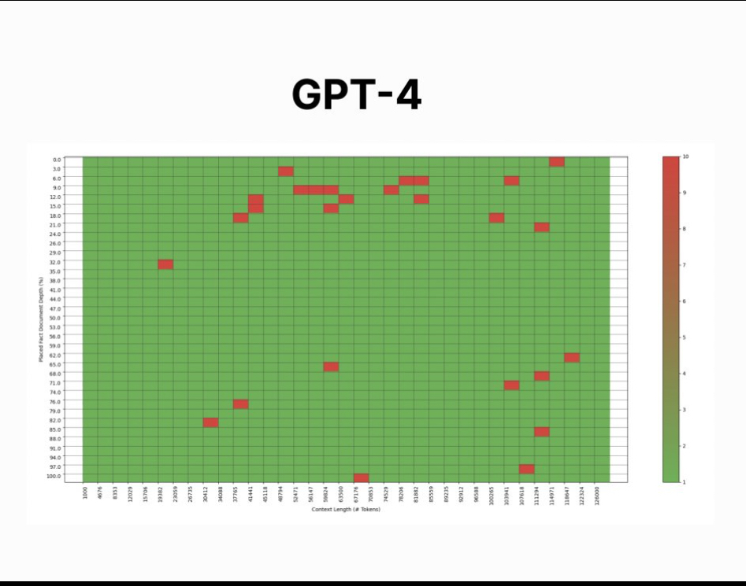

 

::: callout-note
## Is RAG necessary when you have incredible memory?
:::

# Context

Check out this thread:

<blockquote class="twitter-tweet">
(1/8) The Needle in the Haystack done by <a href="https://twitter.com/GregKamradt?ref_src=twsrc%5Etfw">@GregKamradt</a> was an amazing analysis of retrieval performance! Greg has graciously allowed us to build on his work with a repository that is now OSS.<a href="https://twitter.com/natfriedman?ref_src=twsrc%5Etfw">@natfriedman</a> We have a much more rigorous test we’ve put out based on this idea.… <a href="https://t.co/i5O8zrcwQT">pic.twitter.com/i5O8zrcwQT</a>
&mdash; Aparna Dhinakaran (@aparnadhinak) <a href="https://twitter.com/aparnadhinak/status/1735678863814938695?ref_src=twsrc%5Etfw">December 15, 2023</a></blockquote> 

This is a powerful analysis. Sure, Anthropic will find a way to improve or challenge the results. But the point is clear: these technologies can remember hyper specific 7-digit random numbers out of a batch of 126,000 tokens, where a token is roughly 4 characters. GPT is clear winner here, too. 

Also, open source is getting incredibly good. This implies the future is open source. 

<blockquote class="twitter-tweet">
Comparing <a href="https://twitter.com/OpenAI?ref_src=twsrc%5Etfw">@OpenAI</a> <a href="https://twitter.com/hashtag/GPT4?src=hash&amp;ref_src=twsrc%5Etfw">#GPT4</a> Turbo to <a href="https://twitter.com/MistralAI?ref_src=twsrc%5Etfw">@MistralAI</a>   GPT-4 is pretty good in that region in general. Interesting to see how <a href="https://twitter.com/MistralAI?ref_src=twsrc%5Etfw">@MistralAI</a> scales to larger context windows <a href="https://t.co/WQo6MmGIHh">pic.twitter.com/WQo6MmGIHh</a>
&mdash; Aparna Dhinakaran (@aparnadhinak) <a href="https://twitter.com/aparnadhinak/status/1735747087021600916?ref_src=twsrc%5Etfw">December 15, 2023</a></blockquote> 

# Impact

RAG can be used to make retrieval more efficient. But if retrieval is already super efficient maybe RAG is only a short term thing. Context lengths of 10m tokens...probably by next year right?

Start of the year we were at 4K tokens. Now there are 126,000 tokens. 30x improvement. So to do another 30x improvement is 3.76M. So yea, by next year you should be able to just load the entire RAG database into memory. But...gonna be super expensive. 

Point is: would GPT be this effective if it was using RAG over a database? Or is it more effective loading it all into context?

