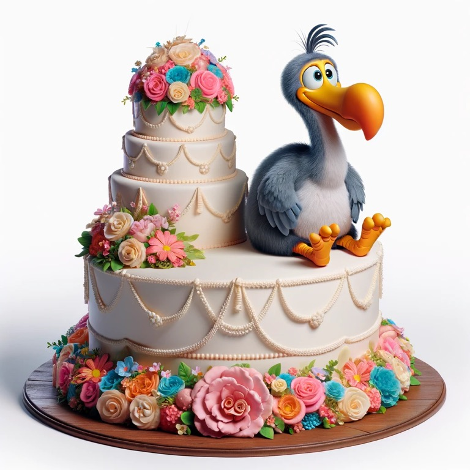

# The scoop 

There's a great kids book, called "There's a dodo on the wedding cake". 

So there's this dodo, right, who walks in and hops on a cake. The attending violinist then scares it away and is praised for protecting the cake. 

To the reader's delight, more animals start appearing and the violinist excitedly protects the cake through hilarious misadventure. (My favorite is when he says, "begone beavers!")

Two funny things happen though:

1. The guy soon realizes that all these creatures are wedding guests. 
2. The guy has such a big nose and he's allergic to marshmallows, that when he's offered some cake he sneezes and the cake goes flying. 

 

# Morale?

1. When you praise someone for doing something good, they do it again and again. → There's a natural hero inside all of us. 
2. But only the first animal was a problem. The beavers were the chefs. So he ends up creating all these problems thinking they're problems. → In tech, when you fix a bug you then think other things are bugs and go off fixing those too. No, just do the first. Then check in. 
3. The irony is that, despite saving the cake, he sneezes and ruins the cake. → Despite all the effort, the greatest protection to the cake was him staying away from it. Sometimes by trying to solve a problem we can make things way worse and create all these problems. (Politics? Create problems by creating solutions to problems that need solutions.)

Don't mistake a beaver for a dodo. But don't mistake a dodo for a wedding guest. 

