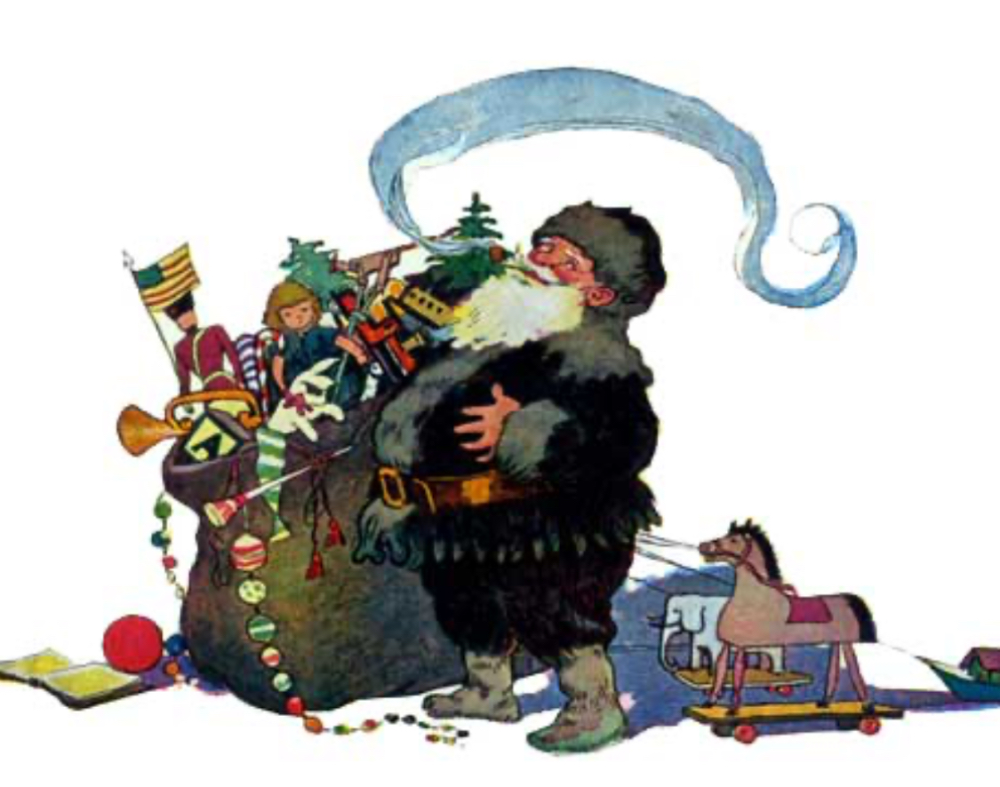

::: callout-tip

- Link to the 1912 publication, [Twas the Night Before Christmas](http://www.gutenberg.org/ebooks/17135)
- original poem was 1820's
- St Nick was 4th century
- Dutch brought the name "Sinterklass" to the U.S. in the 1600's. 
- St Nick becomes red by 1931, thanks to Coke

:::

{.preview-image}

Everything below is produced by GPT:

"How long has the concept of Santa been around? Where did "st nick" come from?"

> The concept of Santa Claus has evolved over many centuries, originating from the historical figure of Saint Nicholas. Saint Nicholas was a 4th-century Christian bishop in Myra, which is now part of modern-day Turkey. He was known for his generosity and for performing miracles, which earned him a reputation as a protector of children and sailors. 

> The name "Santa Claus" evolved from the Dutch "Sinterklaas," a short form of Sint Nikolaas (Saint Nicholas). Dutch immigrants brought the traditions of Sinterklaas to America in the 17th and 18th centuries. In these traditions, Sinterklaas was depicted as a serious, religious figure who rewarded good children and punished the naughty ones.

> During the 19th century, especially in America, the image of Santa Claus as we know it today began to take shape. The 1823 poem "A Visit from St. Nicholas" (commonly known as "Twas the Night Before Christmas") played a crucial role in shaping the modern character of Santa Claus, including his physical appearance and the tradition of delivering gifts to children. 

> Later, in the 19th and 20th centuries, Santa's image was further popularized through various media, including advertisements, films, and songs, which contributed to the jovial, red-suited, and reindeer-driving character recognized globally today. This character represents a blend of the historical Saint Nicholas, folk traditions from various cultures, and modern commercial and media influences.

How did St Nick become red?

> The transformation of Saint Nicholas into the red-suited Santa Claus is a gradual evolution influenced by cultural, artistic, and commercial factors. The image of Santa Claus wearing red clothes began to become popular in the 19th century, but it was solidified in the 20th century, particularly through advertising.

> 1. **19th Century Literature and Art**: In the 19th century, Santa Claus was often depicted in various colors of robes, including blue, green, and brown. However, by the latter half of the 19th century, the image of Santa in a red suit began to appear more frequently in literature and illustrations. Thomas Nast, a prominent American cartoonist, played a significant role in popularizing this image. In his illustrations for Harper's Weekly starting in the 1860s, Nast depicted Santa Claus in a variety of outfits, including the now-familiar red suit.

> 2. **Coca-Cola Advertising in the 20th Century**: The standardized image of Santa Claus in a red suit with white fur trim was popularized and became iconic largely due to Coca-Cola advertising campaigns. In 1931, Coca-Cola commissioned illustrator Haddon Sundblom to create a Santa Claus for their Christmas advertising campaign. Sundblom's Santa was jolly, rotund, and dressed in a red suit with white fur trim, which matched the company's color scheme. These advertisements were widely circulated and became immensely popular, cementing the image of Santa Claus in a red suit in the public's imagination.

> While the red-suited Santa Claus is now ubiquitous, it's important to note that the evolution of his image was influenced by a blend of historical, cultural, and commercial factors over several decades.