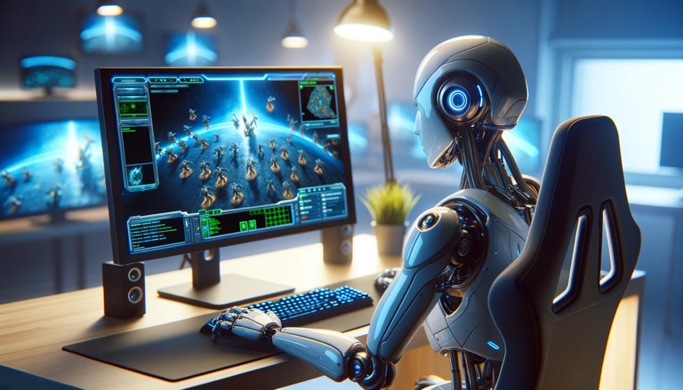

::: callout-tip
## With a proper objective function, machines can do really hard, isolated tasks

- they can walk
- they can solve complex physical challenges
- they can play the toughest strategic games on earth and win (AlphaGo 2017, AlphaStar 2019)
- but can they determine the objective function by themselves?

:::

# Reinforcement Learning

Great article written [at Techradar](https://www.techradar.com/computing/artificial-intelligence/my-jaw-hit-the-floor-when-i-watched-an-ai-master-one-of-the-worlds-toughest-physical-games-in-just-six-hours) going over the advances in reinforcement learning that allow a robot to finish labyrinth faster than humans. The video does the feat even more justice:



This stands out to me in a few ways, principally that they crippled the machine to not take shortcuts. It still won. 

Reminds me first of AlphaGo:



Which reminds me of [AlphaStar](https://deepmind.google/discover/blog/alphastar-mastering-the-real-time-strategy-game-starcraft-ii/). Here's a video with commentary on AlphaStar's performance:



The thing I connect this video (or some other I watched) with labyrinth is that AlphaStar devised brand new strategies. Players against AlphaStar remarked how they felt like it was indeed being creative. Likewise, Cyberrunner (labyrinth) found shortcuts. 

All of this points to reinforcement learning as a viable solution to getting stuff done both in the digital and physical worlds. Take, for example, how RL is used to teach a [robot how to walk](https://interestingengineering.com/innovation/humanoid-taught-itself-to-walk).

{.preview-image}

# What's the objective?

The goal for Super AI will be to figure out what the objective is. If we can marry digital and physical worlds, teaching the systems how to solve objective functions, the possibilities become...super/human. 

The unique thing about a human, it seems, is that we have our objective function hardwired into us: survive. First this is "food/shelter". Next it's social survival. 

How do humans figure out objective functions so fast? A human looking at labyrinth will know what to do within a second. Does it have interest/patience to sit there and learn it? Does GPT 4Vision have the ability to figure out these objective functions?

We learn by objective functions. Minimize wrong answers on a test. Minimize missed baskets on the basketball court. Minimize rejections in a sales funnel. Maximize great conversation and connection at a dinner party. 

Humans learn very quickly. For now, robots are being isolated to specific tasks and their results are impressive. But perhaps to become our overlords all they need is the one objective function to rule them all. Er, uhm, and by "them" I of course don't mean "us"...

