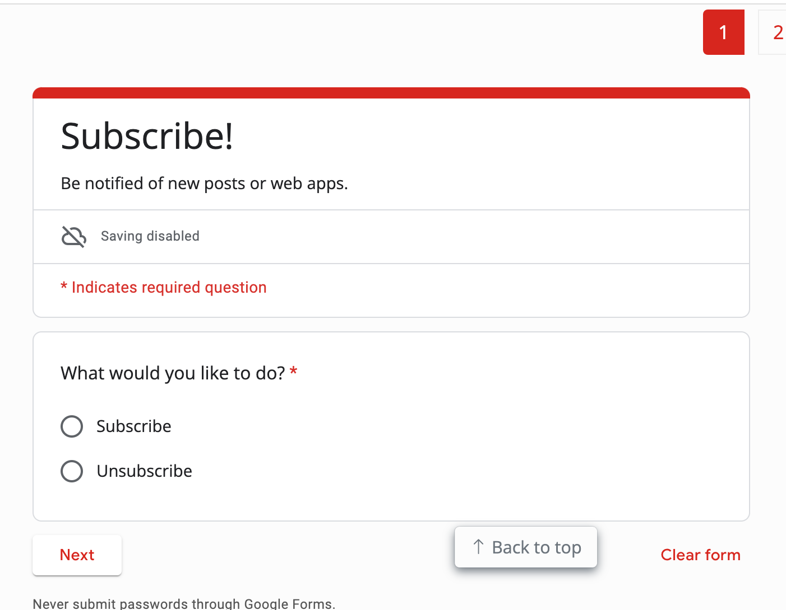
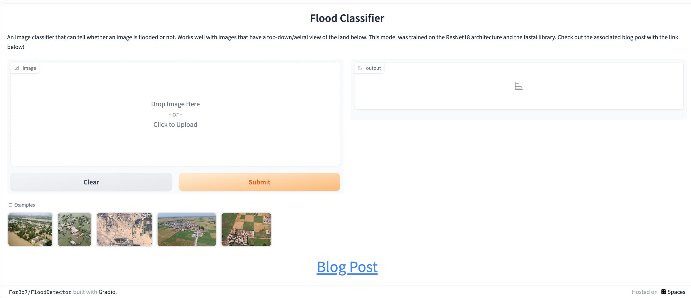

Quarto lists a [gallery](https://quarto.org/docs/gallery/) of things you can do with it.

This post illustrates

1. How you can array your blog
2. How you can collect subscribers with just google form
3. How you can iframe other apps, such as from huggingface.

I came across this site: <https://forbo7.github.io/>. I enjoyed seeing how they arrayed their blogs, which I had never seen before - they used grids. 

{.preview-image}

They use an embedded google form for subscriptions:

And they have an[ iframe on a Huggingface](https://forbo7.github.io/web_apps/apps/flood_detector.html) app to show something cool:

That's all.
