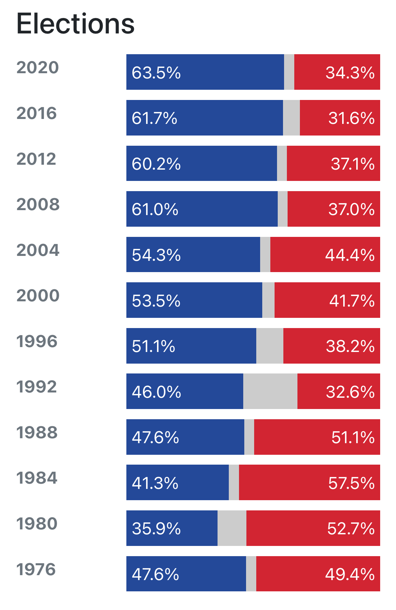

In 2016 I voted independent with the hope that I could have neither Trump nor Hilary. I lived in Virginia, a somewhat swing state, and had a chance of creating an electoral college lock. 

In 2020 I voted independent because I wanted to give a third party a viable say, and I knew that a democrat would earn my delegate votes anyway. (Californian republicans have a say in the house, not the senate or the Oval Office.) a state that has only voted [Democrat since 1988](https://www.270towin.com/states/California).

 

This is interesting because they've had multiple tepiblican 