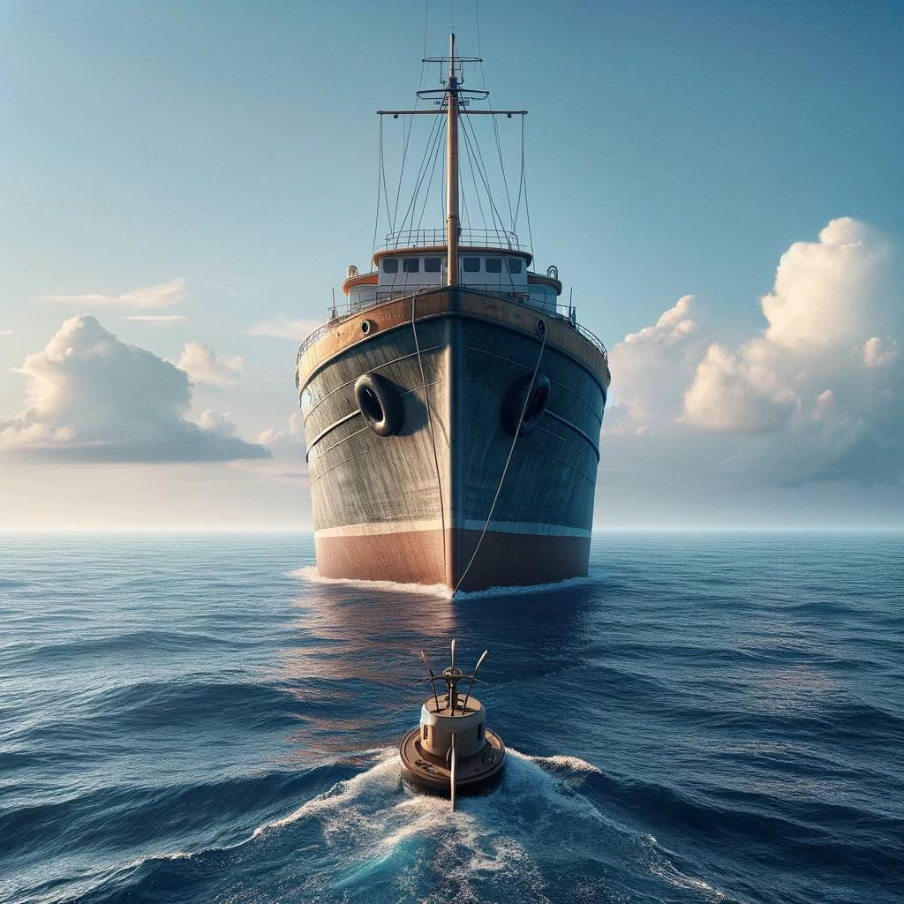

One of the most important asset a company wields is its culture. 

A culture is hard to define, but you know it when you see it. It's the collective personality and written and unwritten rules of engagement. Since corporate employment is a social contract of two at-will parties, the culture emerges from the rules of conduct in which the employer is satisfied with continuing employment of the employee. 

Values are lip service without implementation. Assume your company has the value "be kind". Everyone has a different interpretation of what that means to them. 

How do you know what a good culture is? People know the values of the culture and can highlight practices examples of it. The culture should live naturally, but also mechanically. Meaning, an employee will be kind while holding the door open for someone (be kind), but also provide explicit growth-oriented feedback. 

Signs of a bad culture are therefore evident in the opposite of my definition. Like Lord of the Flies, employees are fending for survival and constantly exploring the boundaries because there are now rules of government. 
Employees that can't recount what the values are or demonstrate how the company mechanically employs them are hoping for natural demonstration but get confused when they get mixed signals. 

Toxic cultures can achieve financial success. "Toxic" has no concrete definition, but probably reveals people trying to survive on the island rather than thrive in a civilization. It stands, therefore, that a great culture will endure the battles of business, and come out tighter. At some point it won't matter how bright your people are, how clever your IP is, or how many customers you have: culture is the rudder. 

{.preview-image}
