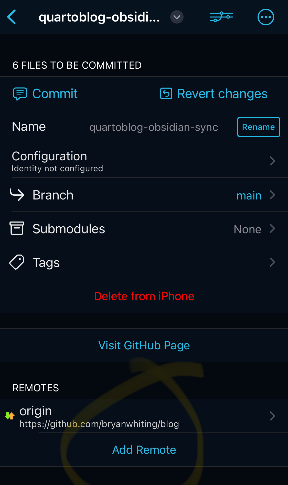

Here are the steps I use to post content from my phone to bryanwhiting.com. 

1. Create a new, empty vault in Obsidian
2. Open working copy, set up synced repo. This means any changes are auto-synced. 
3. Add remote, point it at your GitHub repo where your blog is
4. Set up a "pull, stage, commit, push" shortcut 
5. Set up GitHub actions to build, and push (use my repo's workflow.yaml if you need an example)
6. Have GitHub pages (if your repo is private) or Netlify (if your repo is private, because you can't have a private GitHub repo without paying)

And that's it! Write markdown in obsidian. Push when you're ready, let GitHub actions build and deploy. Check GitHub actions logs for any errors! (You'll get an email if it fails.)

{.preview-image}

