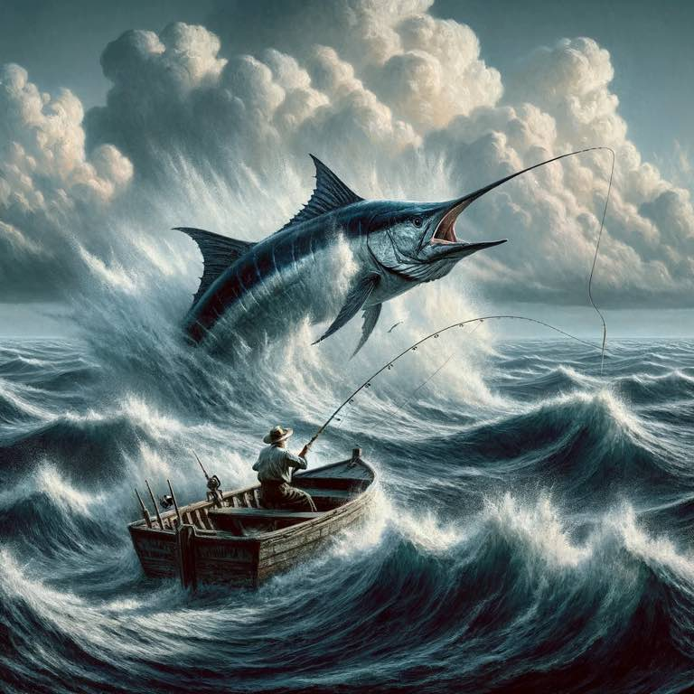

Hemingway introduced through his writing style the [Iceberg Theory](https://www.ijfmr.com/papers/2023/1/1646.pdf). It was something I noticed while reading [The Old Man and the Sea](../book-review/the-old-man-and-the-sea.md). You feel the depth of emotion from the "actions and dialogue", rather than explicit descriptions. 

It's fun to contrast that with [Frank Herbert](../concepts/frank-herbert.md)'s style which is "lay out the environment, have dialogue, then draw conclusions in the mind". 

Both styles speak to the thought that the writing is more interesting the less you write about. They call this "negative space" in drawing. A sketch is interesting when the mind can fill in the gaps. As an artist, you just want to make enough dots that they can connect them themselves. This connecting process is the freedom and interest the mind craves. It doesn't want to be coddled ([The Coddling of the American Mind](../book-review/the-coddling-of-the-american-mind.md)).

Back to the book. The Old Man and the Sea can be summarized in one sentence: a tired, old, and recently-unlucky man catches the biggest of his life and it gets eaten before he makes it home. 

That's the surface story, and it's rather boring when thought of that way. But you just *feel* so much while reading it. You feel for the old man through the young boy. You feel for him as he teeters between passing out and existing. You remember the breaking points in your own life and want the man desperately to succeed. Luck, however, was not on his side. 

"Talk less. Smile more." - Hamilton

{.preview-image}