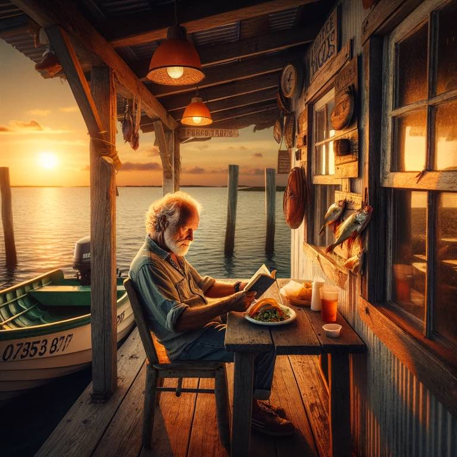

Last night I went to a tapas style restaurant. I got 5 things. Then we opted for one more: battered cod tacos. Our taste buds rewarded us. That's why we came. 

Before that I was telling my wife, "I don't see why my friend didn't like the sushi. It's fine. I just don't know how to evaluate if something is worth it or not. Because it's tasty, I'd recommend it..." This came off the heels of multiple times recently where I've gone out with people who are foodies that criticize the meal I'm enjoying and I'm left wondering: am I a food plebe?

Experiencing this last night was poignant. The whole meal was good. Not bad. Just good. 

Then came the fish tacos. 

That's how it is with reading. You need to read a lot before the good and the bad start filtering out. 

And like fish tacos, maybe there are even better ones out there, but I needed this one to point me in the direction of what's possible. 

And to some degree, there's a dulling of sensitivities. If you haven't read good literature in a long while perhaps you assume it's all fine and "why *not* finish this book?" 

But this year I'm trying to read many authors across many genres to tackle just that: find the books I really enjoy reading. And then ask myself, "why? What was special there?" So that I know what to look for next. 

Last night I began [The Old Man and the Sea](../book-review/the-old-man-and-the-sea.md) and it was a fish taco moment. I don't know how I've avoided this book so long. I'm sure I read it in like sixth grade, but does that even count? And why have I largely avoided fiction for most of my adult life? I suppose having studied something very technical in college it pushed me to stop using that side of my brain. But getting back to good books, written with such depth and creative imagination, renew me with an awareness of the dullness of business books I've been dwelling in. 

{.preview-image}

And now, for ChatGPT to answer the prompt: "in the style of Ernest Hemingway, write three paragraphs about a man eating fish tacos":

> In the style of Ernest Hemingway, characterized by his terse and direct prose, the tale unfolds on a weathered pier stretching into the gray, restless sea. The man, solitary and rugged, sits at the edge where the wood meets the water, a plate of fish tacos beside him. His hands, calloused and strong, deftly assemble the tacos with an economy of movement that speaks of a life shaped by necessity rather than choice. The fish, freshly caught, bears the scent of the ocean, a fragrance as old as time, mingling with the sharp tang of lime and cilantro.
> 
> Around him, the world seems to hold its breath, the only sounds are the soft lapping of waves against the pilings and the distant cries of gulls, wheeling like specters in the overcast sky. He bites into a taco, the crispness of the tortilla giving way to the tender fish within, a simplicity that belies the depth of flavors. There's a harmony here, between man and nature, a momentary peace found in the act of eating, of sustaining oneself with the bounty of the sea.
> 
> As he eats, his gaze is drawn to the horizon, where the gray of the sea blends indistinguishably with the sky. There's a contemplation in his eyes, a man adrift in his thoughts as he is in life, finding solace in the simple pleasure of a meal. The tacos, humble yet fulfilling, become a metaphor for existence itself—uncomplicated in its components, yet profound in its satisfaction. In this moment, on this pier, the man and the sea are one, their stories intertwined in the quiet, unspoken understanding that life, in all its forms, is a series of solitary moments shared with the world.

Dang..."life shaped by necessity rather than choice" and "The tacos, humble yet fulfilling, become a metaphor for existence itself—uncomplicated in its components, yet profound in its satisfaction." I'm glad Ernest is somewhere in there, AI. You may have a soul after all.

See also: [Reading Ethos](../lists/reading-ethos.md)