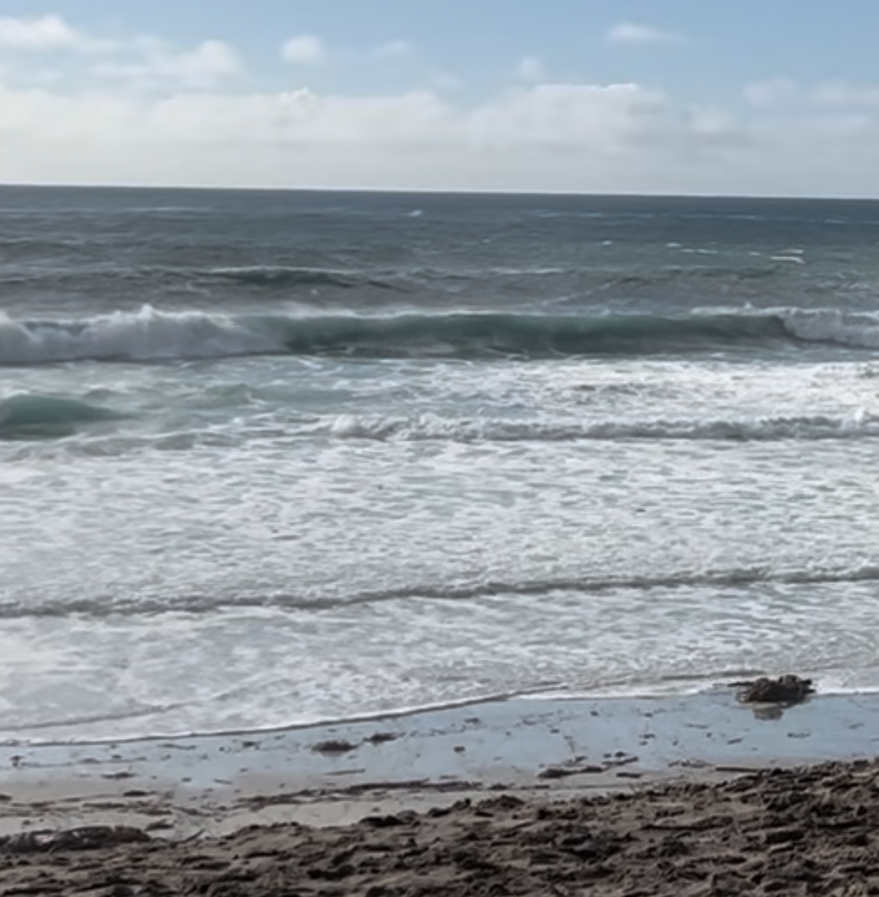

The book [Dune](../book-review/dune.md) is amazing in many ways, but the one that piqued my curiosity today was this: what if water was a currency?

The book gives great reverence to water, specifically talking about the lengths the Fremen go to to preserve their water. They even harvest it the dead, as water is life. They see people around them as water vessels. If you're 100 kg (220lbs), they say you carry 60 kg of water weight. That's a 60 liters. If you drink an average of 2 liters per day, that's enough water to sustain you for 30 days. Fascinating how you would die without drinking water for a week though, right?

Some on this earth live with such water scarcity. Most in the US don't. Consider what else we can focus on because we take the most life-giving substance for granted. 

{.preview-image}