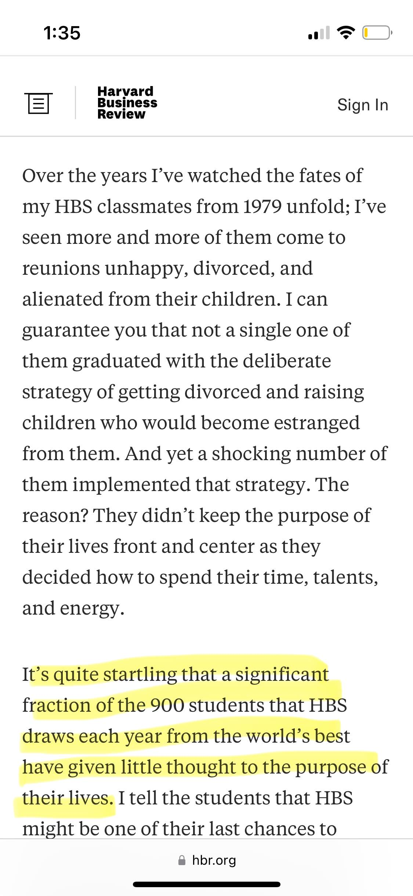

I wasn't much of a founder until I found her.

In 2015 I was running a startup. I had a choice: stay with the company as they moved to Seattle or finish the final year of my masters. 

I chose to finish school. I found her. We founded our family the next summer with a marriage certificate in NY. 

My family has been the most rewarding thing in my life. It's far from perfect, but it's worth everything to me. 

{.preview-image}

[How Will You Measure Your Life?](https://hbr.org/2010/07/how-will-you-measure-your-life)