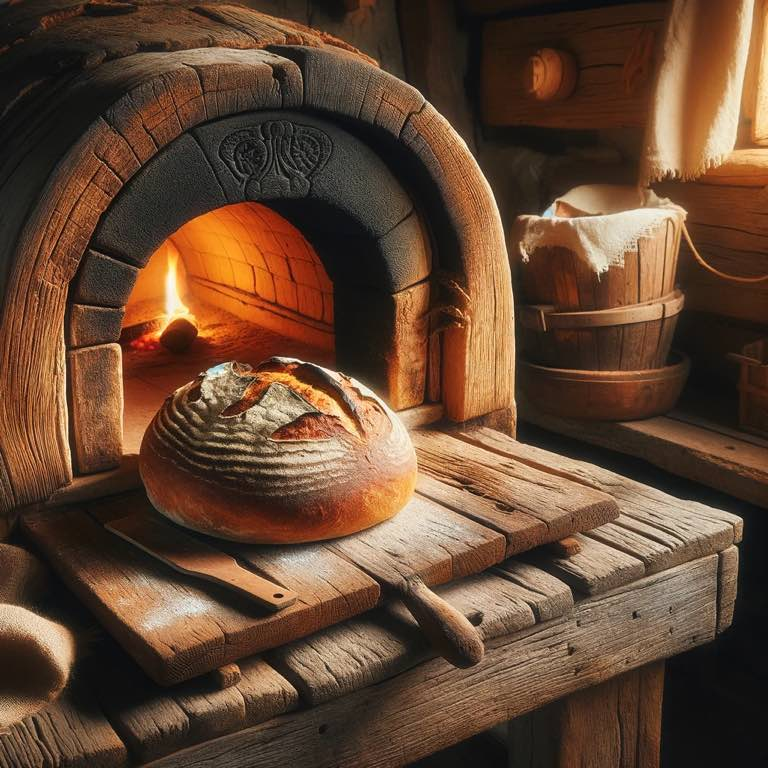

# Symbol

Bread is placed in an oven. Likewise His body was placed in a sepulcher. And he was in that sepulcher three days. When he came out, He was finished as a resurrected Lord. 

{.preview-image}
# Scriptures

> For as Jonas was three days and three nights in the whale’s belly; **so shall the Son of man be three days and three nights in the heart of the earth.**
> [Matthew 12.40](../scriptures/matthew-12.40)

> And he bought fine linen, and took him down, and wrapped him in the linen, and laid him in a sepulchre which was hewn out of a rock, and rolled a stone unto the door of the sepulchre.
> [Mark 15.46](../scriptures/mark-15.46)

# Meaning

Christ prophesied he'd be in the tomb three days, and He was. He keeps His promises. The covenant of the sacrament is a promise, one I can trust. For "I, the Lord, am bound when ye do what I say; but when ye do not what I say, ye have no promise." ([Doctrine and Covenants 82.10](../scriptures/doctrine-and-covenants-82.10))
