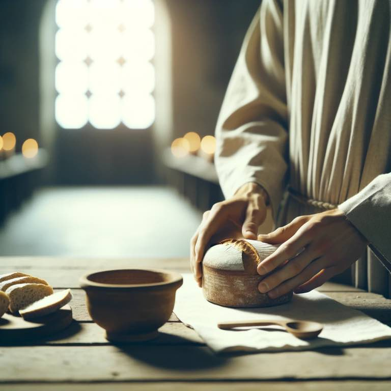

# Symbol

We break bread, but His bones were not broken. Only His flesh. 

{.preview-image}

# Scriptures

Whenever we break the bread, I'm reminded of many things. But one that sticks out is that Christ's legs were commanded to be broken by the Roman leaders:

> The Jewish officials, who had not hesitated to slay their Lord, were horrified at the thought of men left hanging on crosses on such a day, for thereby the land would be defiled; so these scrupulous **rulers went to Pilate and begged that Jesus and the two malefactors be summarily dispatched by the brutal Roman method of breaking their legs**, the shock of which violent treatment had been found to be promptly fatal to the crucified. 
> [Jesus the Christ. Chapter 35. Death and Burial](../scriptures/Jesus-the-Christ-chapter-35.-death-and-burial.md) 

It was a technique practiced by the Romans to hasten the death of the crucified:

> Victims in the head up position could spend several days on the cross before they died. **One technique used by the Romans to hasten death was to break the legs below the knee with a blunt instrument1 (p. 25)**
> [Medical theories on the cause of death in crucifixion - PMC](https://www.ncbi.nlm.nih.gov/pmc/articles/PMC1420788/#)

A bit graphic, but how did this technique possibly accelerate the death? 

> According to those who have studied the grim mechanics of crucifixion, in order to breathe adequately, the crucified victim periodically had to push himself up using his legs. **Breaking the legs prevented him from doing that, thus hastening his death. He would suffocate.**
> [Why are the crucified persons' legs broken?](https://www.stcatherinercc.org/single-post/2018/03/14/why-are-the-crucified-persons-legs-broken)

But Christ's legs were *not* broken as instructed. Continuing the quote above from Jesus the Christ:

> ...The governor gave his consent, and the soldiers broke the limbs of the two thieves with cudgels. **Jesus, however, was found to be already dead, so they broke not His bones.** Christ, the great Passover sacrifice, of whom all altar victims had been but suggestive prototypes, died through violence yet without a bone of His body being broken, as was a prescribed condition of the slain paschal lambs.
> [Jesus the Christ. Chapter 35. Death and Burial](../scriptures/Jesus-the-Christ-chapter-35.-death-and-burial.md) 

Why? Why weren't the bones broken? Why is this significant?

The bones of a paschal lamb were meant *not* to be broken. 

It dates back to the Mosiac Passover in Egypt (when the firstborns of the Egyptians and the Pharaoh were killed)

> In one house shall it be eaten; thou shalt not carry forth ought of the flesh abroad out of the house; **neither shall ye break a bone thereof.**
> [Exodus 12.46](../scriptures/exodus-12.46)

> They shall leave none of it unto the morning, nor break any bone of it: according to all the ordinances of the passover they shall keep it.
> [Numbers 9.12](../scriptures/numbers-9.12)

It was prophesied that "Many are the afflictions of the righteous: but the Lord delivereth him out of them all. **He keepeth all his bones: not one of them is broken**." ([Psalm 34.19–20](../scriptures/psalm-34.19-20))

John testified of the fulfillment of this prophecy:

> The Jews therefore, because it was the preparation, that the bodies should not remain upon the cross on the sabbath day, (for that sabbath day was an high day,) besought Pilate that their legs might be broken, and that they might be taken away.  32 Then came the soldiers, and brake the legs of the first, and of the other which was crucified with him.  33 But when they came to Jesus, and saw that he was dead already, **they brake not his legs:**
> [John 19.31–33](../scriptures/john-19.31-33)

> 36 For these things were done, that the scripture should be fulfilled, A bone of him shall not be broken.
> [John 19.36](../scriptures/john-19.36)

So while we break the bread, His bones were not broken. Just His flesh. 

# Meaning

The details that were fulfilled at His death remind me of His prophetic life. The fact that he was killed according to the law, and the law predated him and is scripture in the Torah, is further evidence that Christ truly lived and that his life was a fulfillment of prophecy. 

Likewise, those same details apply to my life. He is involved in those details. [Alma 37.7](../scriptures/alma-37.7.md) 