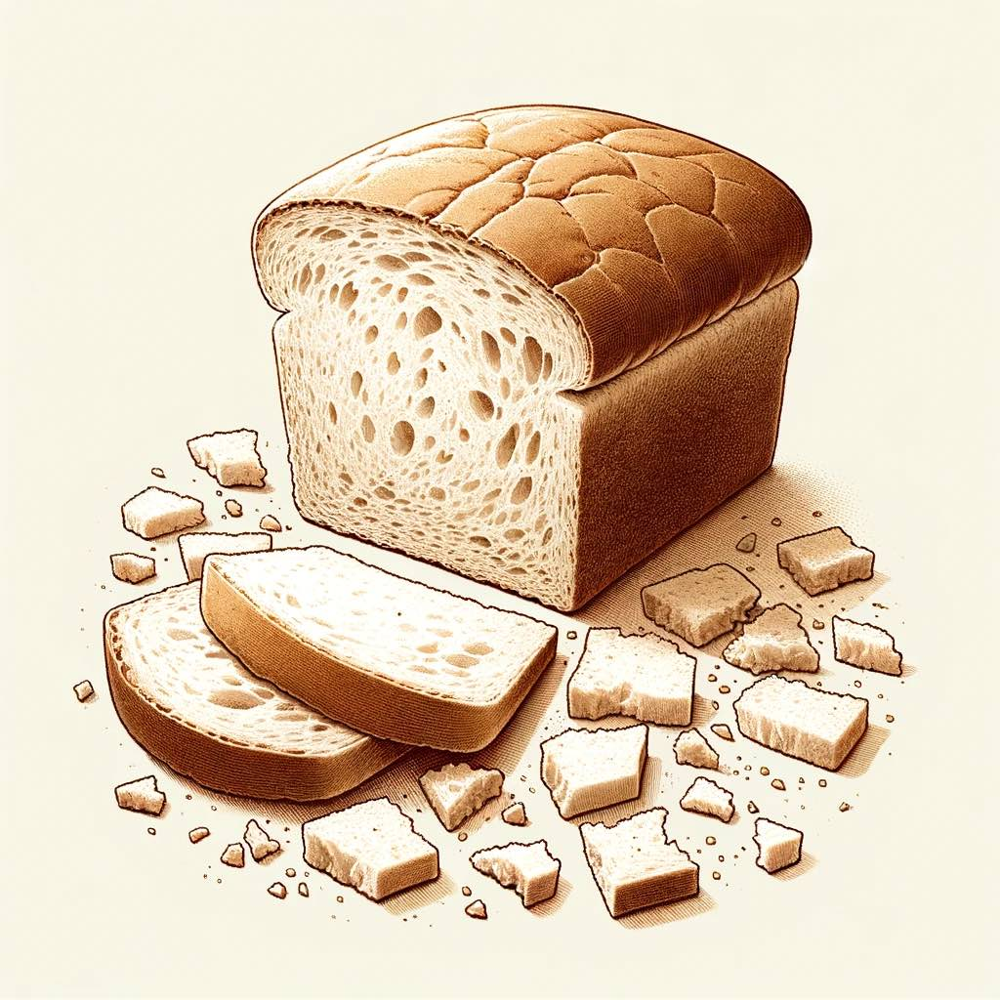

# Symbol

When I take the bread, I eat. Eating takes something whole and makes it smaller. Each bite can remind me of a whip. Of a crown. Of a nail. Of a drop of blood. 

{.preview-image}
# Scriptures

Christ's final moments:

1. Betrayal. Judas chose to forsake his Savior for money. Jesus knew this would happen, but he also went into the garden to atone for the bitterest sin of all: knowing who the Savior is and turning altogether away from him. Christ must have felt true sorrow for a lost brother that day. 
2. Loneliness. Where were his disciples while he suffered in the garden? They couldn't stay awake. 
3. Incredible emotional and spiritual pain - paying the debts of the world across time and space. Of all galaxies. 
4. Disbelief of his followers. In his final moments with the Savior, Peter defied the will of the Lord, chose violence, and cut off the ear of a soldier. 
5. Noose. He was walked like a lamb with a noose around his neck. 
6. Crown of thorns. 
7. Whips. 
8. Mockery. 
9. Heavy burden of carrying his cross. 
10. The nails

# Meaning

Each bite slowly decomposes the bread. Each attack on the Savior slowly decomposed his body, spirit, and mind to the point He felt forsaken by His Father. But he kept doing the will of the Father even as He felt forsaken. He showed the Way. 

