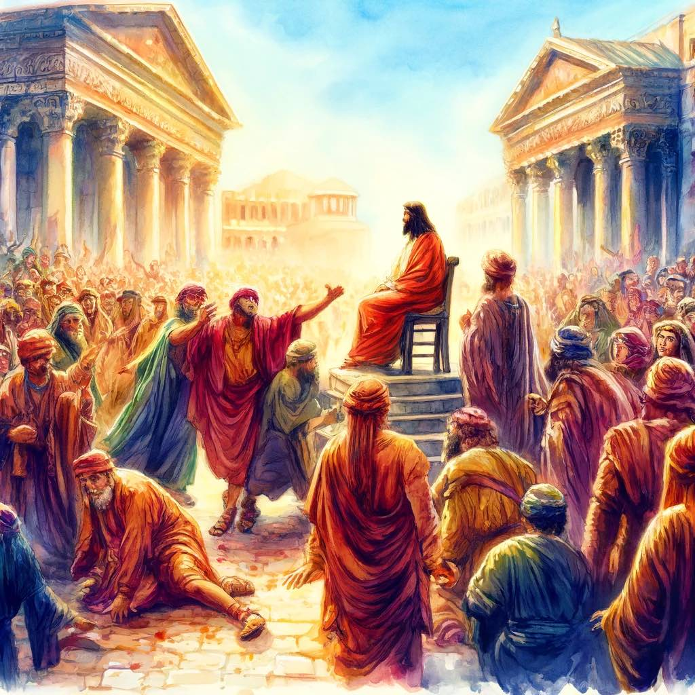

# Symbol

I thought of a funeral today while taking the sacrament. Everyone here is attending a funeral: in memory of our Savior. 

We remember Him. We talk of Him. We celebrate His life.

Most people show up to a funeral dressed in black. But he resurrected in white. And in the temple, we dress in white as He was resurrected. 

{.preview-image}
# Scriptures

> **For ye are bought with a price**: therefore glorify God in your body, and in your spirit, which are God’s.
> [1 Corinthians 6.20](../scriptures/1-corinthians-6.20)

> Lift up your hearts and be glad, for I am in your midst, and **am your advocate with the Father**; and it is his good will to give you the kingdom.
> [Doctrine and Covenants 29.5](../scriptures/doctrine-and-covenants-29.5)

> Listen to him **who is the advocate** with the Father, who is pleading your cause before him—  4 Saying: Father, **behold the sufferings and death of him who did no sin,** in whom thou wast well pleased; behold the blood of thy Son which was shed, the blood of him whom thou gavest that thyself might be glorified;  5 Wherefore, Father, **spare these my brethren that believe on my name, that they may come unto me and have everlasting life.**
> [Doctrine and Covenants 45.3–5](../scriptures/doctrine-and-covenants-45.3-5)

# Meaning

One distinction between a funeral and a sacrament memorial service is that usually at a funeral you don't focus on how they died. It's too painful, especially if the death was unanticipated. 

But at a sacrament meeting we take His bread, broken to symbolize the broken body. And we drink the water, to symbolize the blood that he shed in the garden, that he spilled on the cross under a crown of thorns and a litany of nails. 

Why is this important? Because His life would have no value if He didn't die for us. And he died for us. And how he died is relevant because it's the price He paid for us. And knowing we've been bought with a price matters because it means we're bound to him. 

Remembering His death and how He died reminds me that I want to live like He did. 

He didn't just die. How He died is everything. He died bleeding for us. He died with His last breath for us, instead of for Him. He didn't just accept His place on the cross, He exchanged His physical life for our eternal lives. Barabbas was freed in exchange for Him, and we are Barabbas. We are the wicked sinners freed as He went guiltless to the execution. Can you imagine His disciples sitting in the chanting crowd and thinking: "you're releasing the wrong man! One convicted for his crimes, the other convicted by those who hate their Messiah!" Yet they didn't know that they're as far from God in some ways as Barabbas is...

And despite all the pain we put Him through, He is our Advocate. 