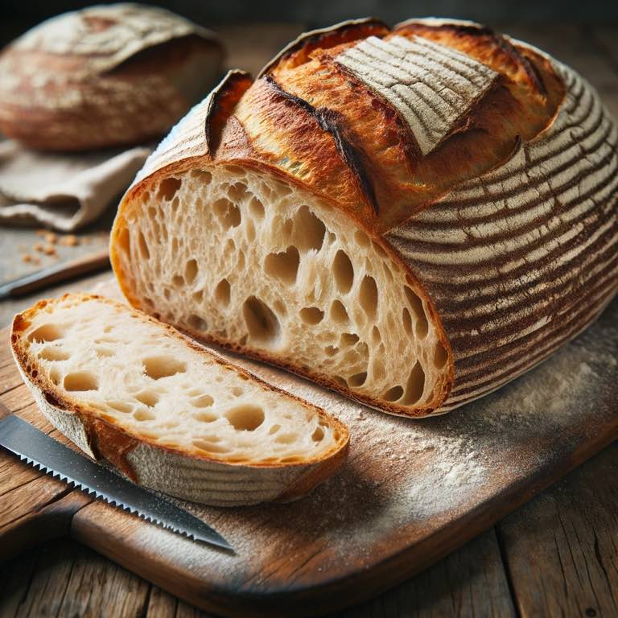

# Symbol

Bread is porous. 

- In the sacrament, the bread (flesh) is first broken, then the water (blood) is administered.
- Blood follows broken flesh. Blood flowed through the broken flesh. The pores of the flesh. 

Bread, being porous, is also absorbent. → He absorbed our problems. He internalized them inside His flesh to the point that his own blood didn't have space internally anymore and exited through the pores. 

{.preview-image}

# Supporting Scriptures

> And lo, he shall suffer temptations, and pain of body, hunger, thirst, and fatigue, even more than man can suffer, except it be unto death; for behold, blood cometh from every pore, so great shall be his anguish for the wickedness and the abominations of his people.
> [Mosiah 3.7](../scriptures/mosiah-3.7)

# Meaning

The Savior suffered an enormous amount. Even the thought of imagining blood coming out of my pores evokes thoughts of feeling so much physically overwhelming internal pressure or emotional agony that it would make a human body explode. 

I can remember this when I pray. I can feel heard because He not only felt what I feel today, but he knows the future me, the past me, and the past/present/future everyone else. When I pray, I'm not approaching a distant God. I'm approaching the one that understands humanity better than any human possibly could. Someone that understands me more than I'll ever understand myself. Someone who's been there. 

When I pray, I don't have to give pretenses, because "your Father knoweth what things ye have need of, before ye ask him." ([Matthew 6.8](../scriptures/matthew-6.8))