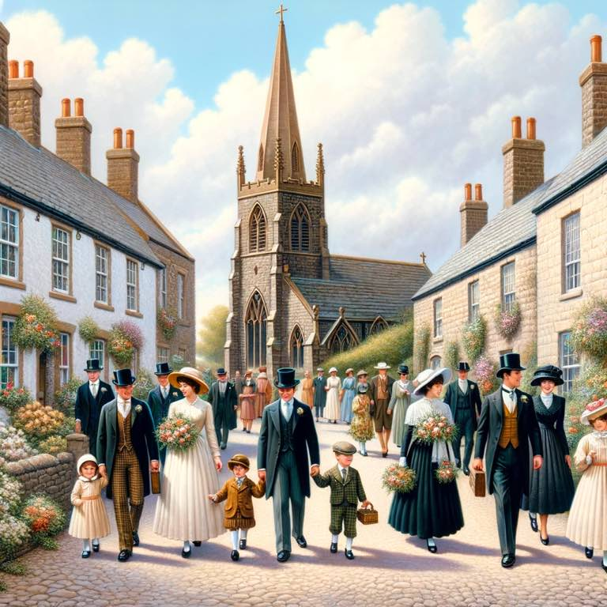

# Symbol

We show up to take the sacrament in our Sunday best. There were many "sinners" who came and adored the Lord. A lady gave him oil and washed His feet. The widow gave two mites. The publicans prayed for forgiveness while the Pharisees judged them. 

We give Him our best when we show up, as sinners, to offer Him a broken heart and contrite spirit. 

{.preview-image}

# Scriptures

> And one of the Pharisees desired him that he would eat with him. And he went into the Pharisee’s house, and sat down to meat.  37 And, behold, a woman in the city, which was a sinner, when she knew that Jesus sat at meat in the Pharisee’s house, brought an alabaster box of ointment,  38 And stood at his feet behind him weeping, and began to wash his feet with tears, and did wipe them with the hairs of her head, and kissed his feet, and anointed them with the ointment.
> [Luke 7.36–38](../scriptures/luke-7.36-38)

The Pharisees didn't like that she was a sinner. 

> Now when the Pharisee which had bidden him saw it, he spake within himself, saying, This man, if he were a prophet, would have known who and what manner of woman this is that toucheth him: for she is a sinner.
> [Luke 7.39](../scriptures/luke-7.39)

We are redeemed by Him when we come with such a spirit as this woman. 

> Behold, he offereth himself a sacrifice for sin, to answer the ends of the law, unto all those who have a broken heart and a contrite spirit; and unto none else can the ends of the law be answered.
> [2 Nephi 2.7](../scriptures/2-nephi-2.7)

# Meaning

The sacrament isn't for those who are perfect. It's for me, a sinner. One who sins. And is sinning and doesn't even know it. One who is separated from the happiness God would have me fully feel because of my ignorance, my natural state. I am good. I am loved. When I pray, He already knows I'm a sinner and loves me regardless. He doesn't want me to see myself as a sinner, but as a worshipper who has much to grow from. And I am growing. 