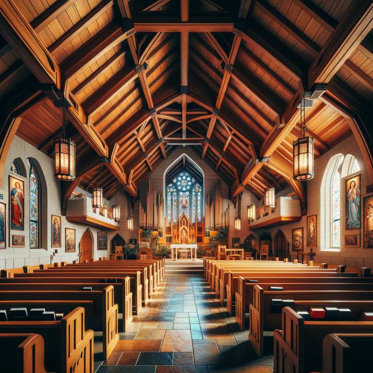

Today I noticed the wooden beams supporting the roof of my chapel building. 

Christ is our foundation. He's our rock. But he also carried the cross up the hill. People looked up to him in His last moments. 

Likewise this beam above me can represent His ascension above the cross. It can also remind me to take up His cross. 

{.preview-image}

> 24 Then said Jesus unto his disciples, If any man will come after me, let him deny himself, and take up his cross, and follow me.  25 For whosoever will save his life shall lose it: and whosoever will lose his life for my sake shall find it.  26 For what is a man profited, if he shall gain the whole world, and lose his own soul? or what shall a man give in exchange for his soul?
> [Matthew 16.24–26](../scriptures/matthew-16.24-26)

The irony of the cross is that He was the Law, the one who gave Moses the book of Deuteronomy. And he was sentenced to death by the same law he gave to the Israelites:

> And if a man have committed a sin worthy of death, and he be to be put to death, and **thou hang him on a tree:**
> 23 His body shall not remain all night upon the tree, but thou shalt in any wise bury him that day; (for he that is hanged is accursed of God;) that thy land be not defiled, which the Lord thy God giveth thee for an inheritance.
> [Deuteronomy 21.22–23](../scriptures/deuteronomy-21.22-23.md)

The irony is that while he fulfilled the law of Moses, he was condemned according to it.