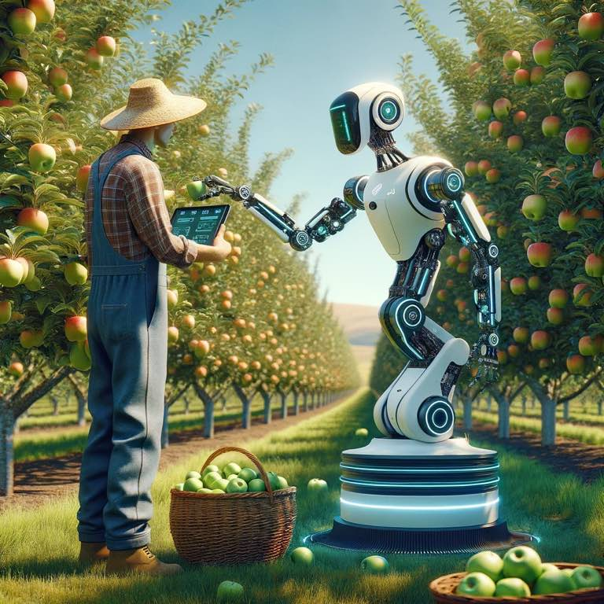

I see a lot of executives dive into AI with a fury of excitement - the possibilities are endless. As it results, chatbots offering used cars for $1, refund policies you don't want to stand behind and having the system generate fake legal briefs ([Air Canada's failed AI-generated Refund Policy and other AI mishaps: When you need guardrails on your AI](three-ai-failures-needing-guardrails.md)).

I see this with experienced executives saying "I want to just infuse my product with AI." For example, "I've got 100 PDFs and a wealth of knowledge that I want to integrate into my app". 

Imagine you're an unknown artist. What's more likely for success: pain something you want, or paint something by commission?

{.preview-image}

Software fails when software developers build something because it sounds like a good idea. Essentially, they build a solution looking for a problem. Or they believe "if I build this my customers will love it."

The same goes for AI. We're at a new wave where anything is possible. Perhaps you're so entrenched in a problem you intuitively know the solution, build something, and your customers (or coworkers) love what you've made. 

Far more likely is you end up believing AI isn't working. 

Here are the five questions you should ask before adopting AI:

1. Whats the job my customer will hire my AI to do? ([Know Your Customers’ “Jobs to Be Done”](https://hbr.org/2016/09/know-your-customers-jobs-to-be-done))
2. Why will they hire my AI? 
3. How much is not having my AI costing them?
4. If my AI didn't exists, whats the stupidest way my customers could get an 80% solution?
5. If my AI does exist in all its glory, why will it fail miserably to do the job its hired to do?

Too many dive straight to a solution. 

Yes, AI is and will revolutionize jobs. The first ones it'll revolutionize are the obvious ones: the boring or time intensive tasks that you're already doing. For Hollywood, AI will replace the laborious task of generating storyboards and such ([Unreal AI: Meet Sora](unreal-ai-sora.md)). They're not trying to solve world hunger (first) at open AI. They're trying to replace jons that are already being hired for. They want to replace truck drivers with AI drivers, warriors with AI drones, and creatives (artistic, musical, and software) with AI. They invented a whole new way of doing...the thing that needed to be done anyway. 

Don't solve a problem that nobody cares about. Because at this point in the economy your customer already has Google, competitors they can go to, and half baked solutions they can already muster on their own. What they need from you is a solution to their biggest problem, now. 

Maybe AI will solve that. Maybe some basic software will instead. Ask yourself these three questions:

1. Will this save time?
2. Save energy?
3. Save money?

If not, it's not worth your time, energy, or money to develop. 