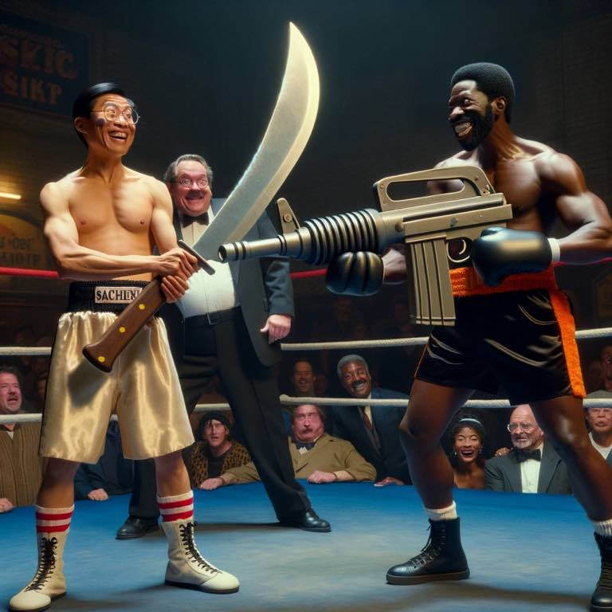

Tim Ferris describes why he doesn't have social media on his phone:



I recently deleted social media from my phone 14 days ago. I had been using Instagram until April when I quit and Twitter all year. I realized within days how much better I felt without social media. Happier. Legitimately happier.

And why? What do I get out of it? I'm not growing closer to friends. That's what texting and calling and spending time in person does. But I'd argue even texting doesn't really strengthen a relationship because it's so hard to properly interpret emotions and cues via text: you interpret them how you read those texts. You interpret it according to your emotional state, not the sender's.

Phone provides vocal emotional cues. Body language another set of emotional cues. I can get probably 70% of this out from FaceTime or [Zoom](../gratitude/zoom.md). But being in person is what we're meant for.

This is why we strengthen relationships locally, and fail to continue ones from high school or our previous job.

So what was I doing on social media? Watching clips of either strangers I don't care about or college associates I friended (once lived locally with) that I no longer talk to.

So what's the knife you're bringing to the gun fight? When at YouTube I heard the CEO praise a team for increasing "seconds watched" by 15% by reducing the lag of the swipes between YouTube shorts (TikTok clone). The lag reduction was in the milliseconds. Your attention is being bought and manipulated by the shareholders of these companies.

{.preview-image}

They A/B test everything. This isn't morally wrong. It's actually quite human: we all A/B test everything every day. A joke here. A smile there. We put out feelers and see if we get a reaction. Don't believe me? Ask my kid why he keeps throwing things in the toilet!

Billions of dollars and the brightest minds on earth are working at FAANG. Why? They need to provide for their families and academics doesn't pay. Non-profits don't pay. This isn't immoral, it just is. There are very good people working there: honest, moral people. Some of the best I've seen in the industry. But when you get paid to maximize swipes, you maximize swipes. It's just human nature. And some of them buy into the odd notions of "snackable content", as if swiping for 30 minutes while on the toilet is what anyone wakes up excited to do. Keep on snacking…

Social media and Netflix provide a ton of value to the world in my opinion. I can use them to call anyone I want, raise money for a cause, or get likes on a cute pic of my cat (I don't have a cat). I *do* see the value.

But the costs for me have outweighed the value.

I *do* miss laughing about some random Reel. There's nothing that can get you laughing faster than a 10 second clip paired with the right cuts and music and everything. The right meme just nails it in a way nothing else can. I miss seeing memes from my friends. But when all I do is send memes to these friends, is that a friendship?

Since being off social media I feel like my senses have grown. I now find my kids a lot funnier, my wife funnier, and I'm able to make heavy situations lighter much easier.

There's a quote in [Dune](../book-review/dune.md) that's something like "If you rely only on your eyes, your other senses weaken". I'd argue my other relationships weakened too. Time to leave the fight. I was losing.
