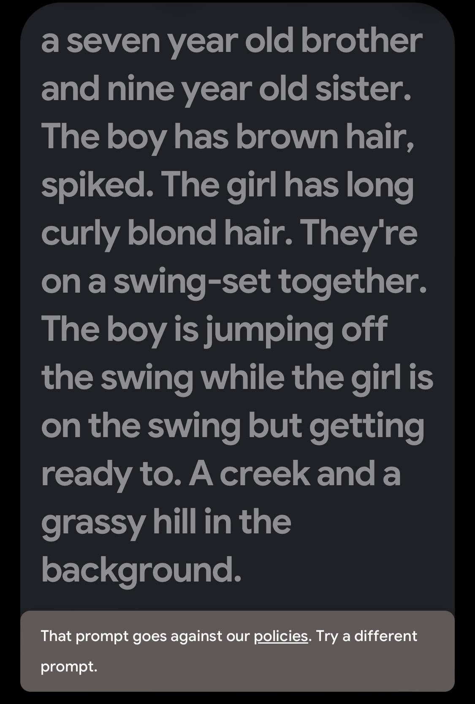

First seen on: [Ethan Mollick on LinkedIn: I think that Google may have come out of nowhere to have the best LLM… | 19 comments](https://www.linkedin.com/posts/emollick_i-think-that-google-may-have-come-out-of-ugcPost-7162219043054170112-73pn?utm_source=share&utm_medium=member_ios)

[ImageFX](https://aitestkitchen.withgoogle.com/tools/image-fx#) Is the tool to generate images with Google's Gemini. I've been a huge fan of using ChatGPT on iOS to get images for this blog. You can decide for yourself which ones are actually good or not. But it's helped me associate a post with an idea (image), which I think is incredibly helpful for memory retention. So my theory has been: some content is better than no content. The other thought is: better learn now what these tools are and how to use them because you never know where you're going to be able to take them. They're like learning how to drive a car: if you can drive, you can go places. 

So how does ImageFX compare? 

# Battle Prompt

> a battle of chatgpt vs Google Gemini photo generators. Psychedelic. Parasitic. Enlightened. Groovy. Ethereal. Down to earth.

Google:

And ChatGPT:

{.preview-image}

This is but one test, and clearly chatGPT wins. 

# Fast Car Prompt

> Image: sports car driving along the highway. Scenic. Photographic. Realistic. Focused camera, low aperture. Beach off in the distance. Windy roads.

Google:

ChatGPT:

{.preview-image}

Interestingly, ChatGPT added a camera *and* had the identical photo inside the camera's viewport. I'm really not sure how LLMs are that capable, that's some diffusion inside diffusion. 

But winner goes to Gemini here! That nails the image best. 

Also, Gemini has an editor that pops up that lets you swap out backgrounds or objects. Pretty neat!

{.preview-image}

# Human

Let's see how they do on people. 

> Image: a seven year old brother and nine year old sister. The boy has brown hair, spiked. The girl has long curly blond hair. They're on a swing-set together. The boy is jumping off the swing while the girl is on the swing but getting ready to. A creek and a grassy hill in the background. 

Google:

{.preview-image}

ChatGPT:

{.preview-image}

ChatGPT wins by TKO on this one. Gemini perhaps can't generate images of kids? Not sure. 

# Final Battle: Picturesque Landscape

Nothing better than a sunset, right?

> Sunset over the San Francisco Bay. Taken from the East, the Golden Gate Bridge is in visible. The sunset is bursting through a gentle fog, angle is taken from higher in the air, perhaps 1000 feet as if from a low helicopter view. 

Google:

ChatGPT:

{.preview-image}

And a real photo taken from Google Images:

{.preview-image}

Winner here is Google Images search! Both of those photos are bad. ChatGPT nailed the fog, which Gemini omitted. Gemini is much closer to the mark but made up a city to the right. Both of them couldn't produce the right angle for the sun. But hey, they're both better than nothing!

# Conclusion

Gemini is here! I can now use it to create images from my phone. 

As a consumer, I think the mobile experience of ChatGPT is really great. But if I'm on desktop I may use Gemini because it gives me four variations for each prompt. And it's free. Can't beat free. 

But ChatGPT can do crazy things that Gemini can't, such as the head to head battle. 

